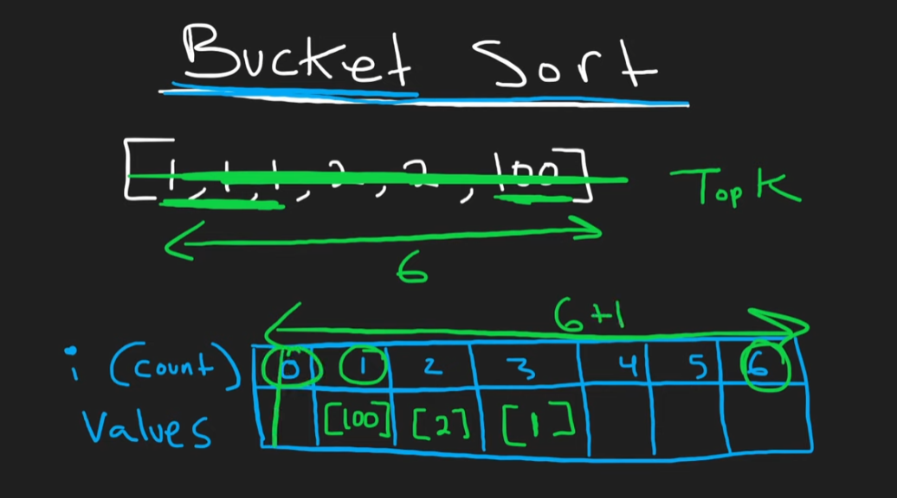
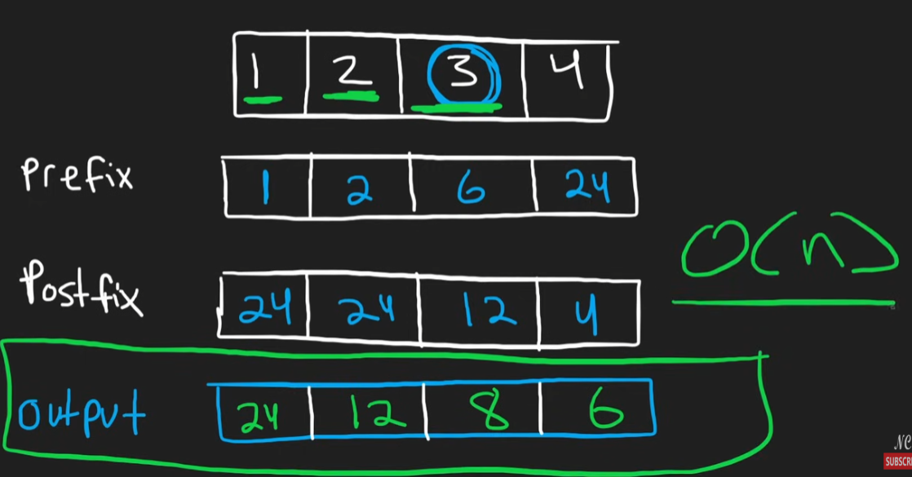

## Contains Duplicate

```python
class Solution:
    def hasDuplicate(self, nums: List[int]) -> bool:
        nums_set = set()
        for num in nums:
            if num in nums_set:
                return True
            else:
                nums_set.add(num)
        return False
```

## Valid Anagram

```python
class Solution:
    def isAnagram(self, s: str, t: str) -> bool:
        #counter dict
        s_count = Counter(s)
        t_count = Counter(t)
        return s_count == t_count
```

## Two Sum

```python
class Solution:
    def twoSum(self, nums: List[int], target: int) -> List[int]:
        num_table = {}

        for index,num in enumerate(nums):
            if target - num in num_table:
                return [num_table[target-num], index]
            else:
                num_table[num] = index
```

## Group Anagrams

```python
class Solution:
    def groupAnagrams(self, strs: List[str]) -> List[List[str]]:
        res = defaultdict(list)
        for s in strs:
            count = [0] * 26
            for c in s:
                count[ord(c) - ord('a')] += 1
            res[tuple(count)].append(s) # key has to be immutable
        return list(res.values())
```

## * Top K Frequent Elements 



```python
class Solution:
    def topKFrequent(self, nums: List[int], k: int) -> List[int]:
        #bucket sort
        # an array to count the freq
        nums_c = Counter(nums)
        freq = [[] for _ in range(len(nums)+1)] #freq occur at most
        #put cooresponding count to the freq
        print(freq)
        for val,count in nums_c.items():
            freq[count].append(val)
        print(freq)
        res = []
        for i in range(len(freq)-1,-1,-1):
            if freq[i]:
                for num in freq[i]:
                    res.append(num)
                    if len(res) == k:
                        return res
        return res
```

Heap Solution: T O(n * logk) , S O(n + k) - Where n is the length of the array and k is the number of top frequent elements.

```python
        #another way is to maintain a window size heap
        nums_c = Counter(nums)
        #convert into a k size heap, then for the rest, compare if exists
        res = []
        for val,count in nums_c.items():
            heapq.heappush(res,(count,val))
            if len(res) > k:
                heapq.heappop(res)
        final = []
        for i in range(k):
            count, val = heapq.heappop(res)
            final.append(val)
        return final
```

## Encode and Decode Strings

This is a good question that appears in TCP data transfer when determines the data segments.

```python
class Solution:
    
    def encode(self, strs: List[str]) -> str:
        res = ""
        for s in strs:
            res += str(len(s)) + "#" + s
        return res

    def decode(self, s: str) -> List[str]:
        print(s)  # 4#neet4#code4#love3#you
        res = []
        i = 0
        
        while i < len(s):
            j = i
            while s[j] != '#':
                j += 1
            length = int(s[i:j])
            i = j + 1
            j = i + length
            res.append(s[i:j])
            i = j
            
        return res
```

## * Products of Array Except Self



```python
class Solution:
    def productExceptSelf(self, nums: List[int]) -> List[int]:
        #forward and backward
        # 1 2 3 4
        # 1 2 6 24 ->prefix, forward order times 1
        # 24 12 12 4 ->postfix, reverse order times 1
        # the answer is equal to the prefix * postfix  except that index val output
        # so we can first store our prefix in res, then postfix to the current result O(1) time
        prefix, postfix = 1,1
        res = [0] * len(nums)
        res[0] = prefix
        n = len(nums)
        for i in range(n):
            res[i] = prefix
            prefix = nums[i] * prefix

        for i in range(n-1,-1,-1):
            res[i] = res[i] * postfix
            postfix = postfix * nums[i]
        return res
```

- Time complexity: O(n)*O*(*n*)
- Space complexity:
  - O(1) extra space.
  - O(n) space for the output array.

## Valid Sudoku - Simulation

```python
class Solution:
    def isValidSudoku(self, board: List[List[str]]) -> bool:
        #matrix question
        #check diagonal, row, column
        m = len(board)
        n = len(board[0])

        for i in range(m):
            #set for duplicates
            duplicate_set = set( [str(x) for x in range(1,10)])

            for j in range(n):
                if board[i][j] == '.': continue
                if board[i][j] in duplicate_set:
                    duplicate_set.remove(board[i][j])
                else:
                    return False


        for i in range(n):
            duplicate_set = set( [str(x) for x in range(1,10)])
            for j in range(m):
                if board[j][i] == '.': continue
                if board[j][i] in duplicate_set:
                    duplicate_set.remove(board[j][i])
                else:
                    return False

        #check the square, know 9*9, 9 loops
        for i in range(9): # 0,1,2  3,4,5 // 3   6,7,8 ->2
            start_row = i // 3 * 3
            start_index = i % 3 * 3
            duplicate_set = set( [str(x) for x in range(1,10)])
            for j in range(9):
                row = j // 3 + start_row
                col = j % 3 + start_index
                print(row,col)
                if board[row][col] == '.': continue
                if board[row][col] in duplicate_set:
                    duplicate_set.remove(board[row][col])
                else:
                    return False

        return True
```

## * Longest Consecutive Sequence

The core idea is that we only need to check if an element is start of the consecutive sequence by comparing (num - 1) in the hashset, then check the incrementing and get the length

```python
class Solution:
    def longestConsecutive(self, nums: List[int]) -> int:
        # start with the num - 1, put the rest in  the set
        nums = set(nums)
        longest = 0
        for num in nums:
            if num-1 not in nums: #the start index
                count = 0
                while num in nums:
                    count += 1
                    num += 1
                longest = max(longest, count)

        return longest
```

