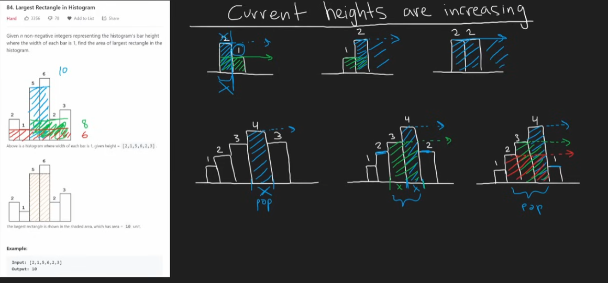
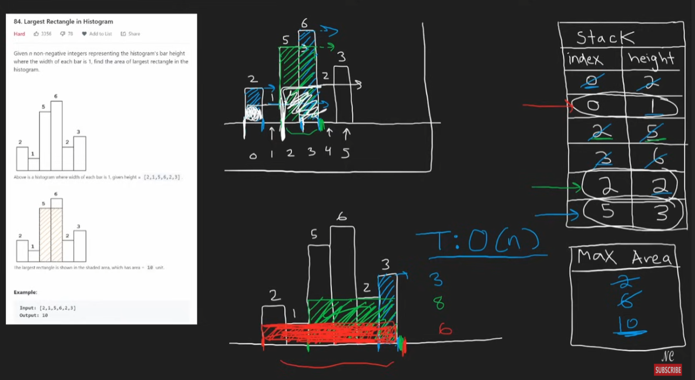

## Stack, Deque

### 📦 Stack (LIFO – Last In, First Out)

In python, stack can be simply represented using the list.

```python
stack = []

# Push
stack.append(10)
stack.append(20)

# Pop
top = stack.pop()  # 20

# Peek
peek = stack[-1]    # 10

# Check if empty
is_empty = len(stack) == 0
```

### 🔁 Deque (Double-Ended Queue)

For more efficient stack/queue operations, use `collections.deque`:, we can also use it to represent queue (FIFO) directly

```python
from collections import deque

dq = deque()

# Stack operations
dq.append(1)     # push to end
val = dq.pop()   # pop from end

# Queue operations
dq.appendleft(2)   # enqueue to front
val = dq.popleft() # dequeue from front
```

Both data structures are O(1).

## Valid Parentheses

```python
class Solution:
    def isValid(self, s: str) -> bool:
        # Use Stack
        stack = []
        
        for char in s:
            # If closing bracket
            if stack and char in (')','}',']'):
                top = stack.pop()
                if top == '(' and char == ')':
                    continue
                elif top == '{' and char == '}':
                    continue
                elif top == '[' and char == ']':
                    continue
                else:
                    # Not a valid match
                    return False
            stack.append(char)
        if stack:
            return False
        return True
```

## Minimum Stack

```python
class MinStack:

    def __init__(self):
        self.stack = []
        # Keep a record of each value with the min

    def push(self, val: int) -> None:
        if self.stack:
            min_value = self.getMin()
            if min_value < val:
                self.stack.append((val, min_value))
            else:
                self.stack.append((val, val))
        else:
            self.stack.append((val, val))

    def pop(self) -> None:
        self.stack.pop()

    def top(self) -> int:
        return self.stack[-1][0]

    def getMin(self) -> int:
        print(self.stack)
        return self.stack[-1][1]
```

## Evaluate Reverse Polish Notation

```python
class Solution:
    def evalRPN(self, tokens: List[str]) -> int:
        stack = []

        for token in tokens:
            # assume the stack would always be true when encounter a symbol
            if token in ('+', '-', '*', '/'):
                right = stack.pop()
                left = stack.pop()
                if token == '+':
                    stack.append(int(left) + int(right))
                elif token == '-':
                    stack.append(int(left) - int(right))
                elif token == '*':
                    stack.append(int(left) * int(right))
                elif token == '/':
                    stack.append(int(left) / int(right))
            else:
                stack.append(token)
        
        return int(stack[-1])
```

## Generate Parentheses

```python
class Solution:
    def generateParenthesis(self, n: int) -> List[str]:
        # Backtracking with stack
        stack = []
        res = []

        def backtrack(openN, closeN):
            if openN == closeN == n:
                res.append(''.join(stack))
                return
            
            # openN should alwasy be greater than closeN
            if openN < n:    # 2 conditions
                stack.append('(')
                backtrack(openN + 1, closeN)
                stack.pop()
            
            if closeN < openN:
                stack.append(')')
                backtrack(openN, closeN + 1)
                stack.pop()
        
        backtrack(0, 0)
        return res
```

## Daily Temperatures - Monotonic Stack

A **monotonic stack or queue** is a data structure that maintains its elements in a **strictly increasing or decreasing order**, allowing efficient access to the next greater or smaller element during traversal or processing. A good [link](https://algo.itcharge.cn/03_stack_queue_hash_table/03_02_monotone_stack/#_1-%E5%8D%95%E8%B0%83%E6%A0%88%E7%AE%80%E4%BB%8B)

```python
class Solution:
    def dailyTemperatures(self, temperatures: List[int]) -> List[int]:
        # Mono stack with the index stored

        stack = []
        res = [0] * len(temperatures)

        for r, temp in enumerate(temperatures):
            while stack and temp > stack[-1][0]:
                val, l = stack.pop()
                res[l] = r - l

            stack.append((temp, r))
        return res
```

## Car Fleet

```python
class Solution:
    def carFleet(self, target: int, position: List[int], speed: List[int]) -> int:
        # position = [4,1,0,7], speed = [2,2,1,1]
        pos_speed = []
        for i in range(len(position)):
            pos_speed.append((position[i], speed[i]))
        
        pos_speed.sort(reverse = True)

        stack = [] # maintain the number of overlapped fleets
        for i in range(len(pos_speed)):
            time_take = (target - pos_speed[i][0]) / pos_speed[i][1] # Float
            if stack and time_take > stack[-1]: # copmare every element, cuz the stack is in increasing order, so we don't need to worry about the order, always compare with the current largest, if over means a new fleet found
                stack.append(time_take)
            if i == 0:
                stack.append(time_take)
                continue
        return len(stack)
```

## Largest Rectangle In Histogram

Core idea is that we need to identify use stack for this problem to aim O(n) time. 

This algorithm uses a **monotonic increasing stack** to find the largest rectangle in a histogram by storing `(height, index)` pairs.

- As you iterate, if the current height is **smaller** than the height at the top of the stack, you **pop from the stack**, treating it as the height of a potential rectangle that ends at the current index.
- For each popped bar, you calculate the area using its height and the width from its stored index to the current index.
- After finishing the iteration, you process any remaining bars in the stack as if they extend to the end of the histogram.





```python
class Solution:
    def largestRectangleArea(self, heights: List[int]) -> int:
        max_area = 0
        stack = [] # Keep track of the areas

        for r, height in enumerate(heights):
            # If the curr height is smaller than previous, pop the stack
            curr = r
            while stack and height < stack[-1][0]: # pop the bar where height is greater than current bar
                l_height, l = stack.pop() 
                max_area = max(max_area, (curr - l) * l_height) # compute the max area
                r = l
            stack.append((height, r)) 
        # And also process the end of stack
        r = len(heights)
        while stack:
            l_height, l = stack.pop()
            max_area = max(max_area, (r - l) * l_height)
        return max_area
```

## Largest Square In Histogram

Got this question in the code signal Q4, the question is basically asking finding the largest square similar to the previous one. And the only difference would be we need to add a constraint this time which we can only choose the minimum(width, height) to calculate the square.

```python
class Solution:
    def largestRectangleArea(self, heights: List[int]) -> int:
        max_area = 0
        stack = []  # (height, index)

        for r, height in enumerate(heights):
            curr = r
            while stack and height < stack[-1][0]:
                l_height, l = stack.pop()
                width = curr - l
                side = min(l_height, width)  # side of the square
                max_area = max(max_area, side * side)
                r = l  # reuse previous left boundary
            stack.append((height, r))

        r = len(heights)
        while stack:
            l_height, l = stack.pop()
            width = r - l
            side = min(l_height, width)
            max_area = max(max_area, side * side)

        return max_area
```


## Summary

### 🧾 Stack, Deque, and Monotonic Stack/Queue Summary

| Structure           | Purpose                              | Python Implementation         | Common Ops (Time)                                       | Notes                                                        |
| ------------------- | ------------------------------------ | ----------------------------- | ------------------------------------------------------- | ------------------------------------------------------------ |
| **Stack**           | LIFO (Last In First Out)             | `list` or `collections.deque` | `append()`, `pop()` – O(1)                              | Use `list` for simple stacks; prefer `deque` for large/modifying stacks |
| **Deque**           | Double-ended queue                   | `collections.deque`           | `append()`, `appendleft()`, `pop()`, `popleft()` – O(1) | Efficient at both ends; good for queues, sliding windows     |
| **Monotonic Stack** | Maintain increasing/decreasing order | `list`                        | Custom push/pop logic                                   | Used in next greater/smaller element problems                |
| **Monotonic Queue** | Maintain increasing/decreasing order | `deque`                       | Custom append/pop logic                                 | Often used in sliding window maximum/minimum problems        |