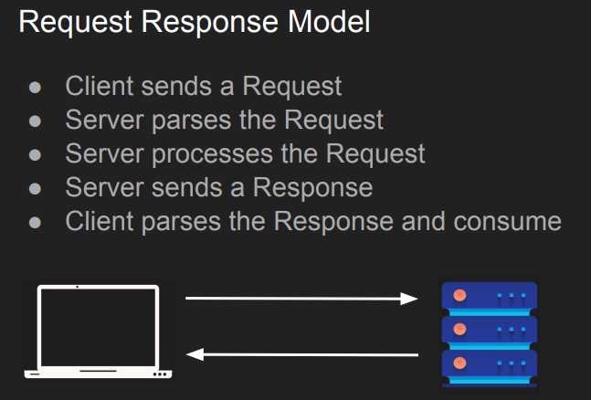

# Fundamentals of Backend Engineering

Here are my notes for the Udemy course: https://www.udemy.com/course/fundamentals-of-backend-communications-and-protocols/learn/lecture/34629332#overview

## Course Outline:

## Section2: Backend Communication Design Patterns

