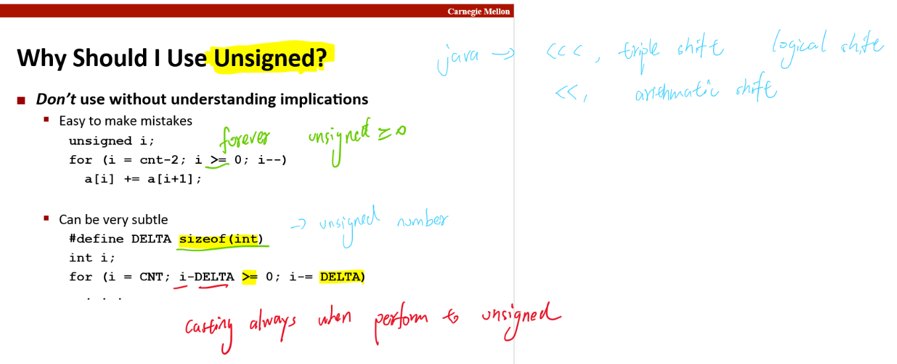
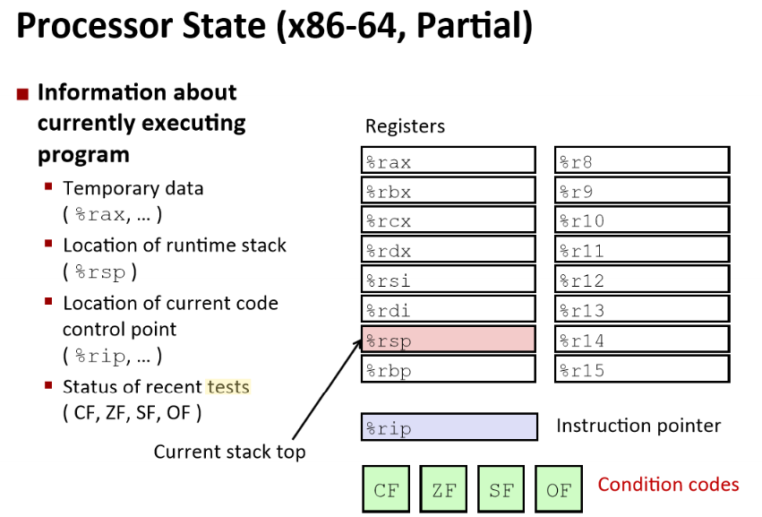

# CSAPP - Computer System

## Lab1

### Floating point:


Will always convert to the form of M = 1.xxx, and M x 2^pow

#### floatFloat2Int(f)

> 将浮点数转换为整数

- 代码

```c
/* 
 * floatFloat2Int - Return bit-level equivalent of expression (int) f
 *   for floating point argument f.
 *   Argument is passed as unsigned int, but
 *   it is to be interpreted as the bit-level representation of a
 *   single-precision floating point value.
 *   Anything out of range (including NaN and infinity) should return
 *   0x80000000u.
 *   Legal ops: Any integer/unsigned operations incl. ||, &&. also if, while
 *   Max ops: 30
 *   Rating: 4
 */
int floatFloat2Int(unsigned uf) {
  int s_    = uf>>31;
  int exp_  = ((uf&0x7f800000)>>23)-127;
  int frac_ = (uf&0x007fffff)|0x00800000;
  if(!(uf&0x7fffffff)) return 0;

  if(exp_ > 31) return 0x80000000;
  if(exp_ < 0) return 0;

  if(exp_ > 23) frac_ <<= (exp_-23);
  else frac_ >>= (23-exp_);

  if(!((frac_>>31)^s_)) return frac_;
  else if(frac_>>31) return 0x80000000;
  else return ~frac_+1;
}
```

- 思路

首先考虑特殊情况：如果原浮点值为0则返回0；如果真实指数大于31（frac部分是大于等于1的，1<<31位会覆盖符号位），返回规定的溢出值**0x80000000u**；如果 𝑒𝑥𝑝<0 （1右移x位,x>0，结果为0）则返回0。剩下的情况：首先把小数部分（23位）转化为整数（和23比较），然后判断是否溢出：如果和原符号相同则直接返回，否则如果结果为负（原来为正）则溢出返回越界指定值**0x80000000u**，否则原来为负，结果为正，则需要返回其补码（相反数）。

The idea is to apply the concept that when converting from the binary int to the float format, need to use the normalized encoding idea.


### Takeaway:




* Any arithmetic operations with unsigned values will cast the result to be unsigned.

*  The size_t defined as unsinged value with length = word size, In C++, `size_t` is a data type used to represent the size of objects. It's an unsigned integer type that's capable of storing the size in bytes of any object. Its actual size can vary depending on the platform and compiler, but it's typically chosen to **be large enough** to represent the maximum possible size of a theoretically possible object on the given platform. size_t is better than used unsigned_int .
*  Reference https://pvs-studio.com/en/blog/terms/0044/#:~:text=The%20size_t%20is%20chosen%20so,64%2Dbit%20one%2064%20bits.
* The **2's complement** of a value is **~x + 1;**


## Lab2


### GDB Debug tool

To debug, use dgb debugged, the pdf can be found at this link

 https://csapp.cs.cmu.edu/2e/docs/gdbnotes-x86-64.pdf

gdb object code or compiled code `gdb bomb`

Inside, running disassmble function `disas <function name>`

`x/s 0x402400` x/s will be used to Examine a string stored at 0xbffff890.


Write a function in x64


### Phase_1

```assembly
Dump of assembler code for function phase_1:
   0x0000000000400ee0 <+0>:     sub    $0x8,%rsp
   0x0000000000400ee4 <+4>:     mov    $0x402400,%esi
   0x0000000000400ee9 <+9>:     callq  0x401338 <strings_not_equal>
   0x0000000000400eee <+14>:    test   %eax,%eax
//Expected return eax to be zero to diffuse the bomb
   0x0000000000400ef0 <+16>:    je     0x400ef7 <phase_1+23>
   0x0000000000400ef2 <+18>:    callq  0x40143a <explode_bomb>
   0x0000000000400ef7 <+23>:    add    $0x8,%rsp
   0x0000000000400efb <+27>:    retq   
End of assembler dump.

Dump of assembler code for function strings_not_equal:
   0x0000000000401338 <+0>:     push   %r12
   0x000000000040133a <+2>:     push   %rbp
   0x000000000040133b <+3>:     push   %rbx
   0x000000000040133c <+4>:     mov    %rdi,%rbx
   0x000000000040133f <+7>:     mov    %rsi,%rbp
   0x0000000000401342 <+10>:    callq  0x40131b <string_length>
   
   
Dump of assembler code for function string_length:
   0x000000000040131b <+0>:     cmpb   $0x0,(%rdi)
   0x000000000040131e <+3>:     je     0x401332 <string_length+23>
   0x0000000000401320 <+5>:     mov    %rdi,%rdx
   0x0000000000401323 <+8>:     add    $0x1,%rdx
   
Address     Value
0x1000      'h'
0x1001      'e'
0x1002      'l'
0x1003      'l'
0x1004      'o'
0x1005      '\0' (null terminator)   
   
   0x0000000000401327 <+12>:    mov    %edx,%eax
   0x0000000000401329 <+14>:    sub    %edi,%eax
   0x000000000040132b <+16>:    cmpb   $0x0,(%rdx)
   0x000000000040132e <+19>:    jne    0x401323 <string_length+8>
   0x0000000000401330 <+21>:    repz retq 
   0x0000000000401332 <+23>:    mov    $0x0,%eax
   0x0000000000401337 <+28>:    retq   
End of assembler dump.


```

 Explain of String_lengh:

`Dump of assembler code for function string_length:
   0x000000000040131b <+0>:     cmpb   $0x0,(%rdi)
   0x000000000040131e <+3>:     je     0x401332 <string_length+23>
   0x0000000000401320 <+5>:     mov    %rdi,%rdx
   0x0000000000401323 <+8>:     add    $0x1,%rdx
   0x0000000000401327 <+12>:    mov    %edx,%eax
   0x0000000000401329 <+14>:    sub    %edi,%eax
   0x000000000040132b <+16>:    cmpb   $0x0,(%rdx)
   0x000000000040132e <+19>:    jne    0x401323 <string_length+8>
   0x0000000000401330 <+21>:    repz retq 
   0x0000000000401332 <+23>:    mov    $0x0,%eax
   0x0000000000401337 <+28>:    retq   
End of assembler dump.`

First, compare the first dereference value at rdi, if not zero, go to the next statement, if zero. return 0.

Copy the input string rdi to the rdx,

Move the pointer one step at rdx,

Copy the edx to eax

Subtract eax from the original edi, it will perform the address subtracting. First loop should return 1 step,

Compare the next pointer address value if it is null with zero. If not, go back to the +8, if yes, it will return the eax reg.

This function is used to calcualte the string length.


In the main code section, the rdi is a  user input,

rsi is the direct access of the memory address at 0x402400.


```assembly
Dump of assembler code for function strings_not_equal:
////what does it do, just compare tow input string, rdi and rsi, return the eax to zero if they are equal else return eax to 1

   0x0000000000401338 <+0>:     push   %r12
   0x000000000040133a <+2>:     push   %rbp
   0x000000000040133b <+3>:     push   %rbx
   0x000000000040133c <+4>:     mov    %rdi,%rbx
   0x000000000040133f <+7>:     mov    %rsi,%rbp
   0x0000000000401342 <+10>:    callq  0x40131b <string_length>
   0x0000000000401347 <+15>:    mov    %eax,%r12d
   0x000000000040134a <+18>:    mov    %rbp,%rdi
   0x000000000040134d <+21>:    callq  0x40131b <string_length>
   0x0000000000401352 <+26>:    mov    $0x1,%edx	
   0x0000000000401357 <+31>:    cmp    %eax,%r12d	//compare the length of two inputs
   0x000000000040135a <+34>:    jne    0x40139b <strings_not_equal+99>	//if not same, end, set eax = edx = 0x1
   0x000000000040135c <+36>:    movzbl (%rbx),%eax
   //what is movzbl, movz, convert the single byte into 4bytes, 8bit -32bit. and zero extend the eax register
   
Zero-Extension
Zero-Extend: This means that the rest of the EAX register (the upper 24 bits) will be set to zero after the byte is moved.
Example: If the byte at (%rbx) is 0x41 (which is the ASCII code for 'A'):
After execution, EAX will be 0x00000041.

   0x000000000040135f <+39>:    test   %al,%al
   //zf set wen a&b == 0, test the rax if the start is null, check the char if it is null, if null then both empty, still same return eax =0
   0x0000000000401361 <+41>:    je     0x401388 <strings_not_equal+80>
   0x0000000000401363 <+43>:    cmp    0x0(%rbp),%al
   0x0000000000401366 <+46>:    je     0x401372 <strings_not_equal+58>
   0x0000000000401368 <+48>:    jmp    0x40138f <strings_not_equal+87>
   0x000000000040136a <+50>:    cmp    0x0(%rbp),%al
   0x000000000040136d <+53>:    nopl   (%rax)
   0x0000000000401370 <+56>:    jne    0x401396 <strings_not_equal+94>
   0x0000000000401372 <+58>:    add    $0x1,%rbx
   0x0000000000401376 <+62>:    add    $0x1,%rbp
   0x000000000040137a <+66>:    movzbl (%rbx),%eax
   0x000000000040137d <+69>:    test   %al,%al
   
   0x000000000040137f <+71>:    jne    0x40136a <strings_not_equal+50>
   0x0000000000401381 <+73>:    mov    $0x0,%edx
   0x0000000000401386 <+78>:    jmp    0x40139b <strings_not_equal+99>
   0x0000000000401388 <+80>:    mov    $0x0,%edx
   0x000000000040138d <+85>:    jmp    0x40139b <strings_not_equal+99>
   0x000000000040138f <+87>:    mov    $0x1,%edx
   0x0000000000401394 <+92>:    jmp    0x40139b <strings_not_equal+99>
   0x0000000000401396 <+94>:    mov    $0x1,%edx
   0x000000000040139b <+99>:    mov    %edx,%eax
   0x000000000040139d <+101>:   pop    %rbx
   0x000000000040139e <+102>:   pop    %rbp
   0x000000000040139f <+103>:   pop    %r12
   0x00000000004013a1 <+105>:   retq   
End of assembler dump.
```



#### Ans: 

(gdb) x/s 0x402400

0x402400:       "Border relations with Canada have never been better."

Border relations with Canada have never been better.

### Phase_2

The `LEA` (Load Effective Address) instruction in x86-64 assembly language is used to perform address calculations and load the result into a register. Unlike other instructions that directly access memory, `LEA` simply computes an address and stores it in a register without accessing the memory at that address.

The purpose of `LEA` is to allow one to perform a non-trivial address calculation and store the result [for later usage]

Lea 用来计算地址，值不会进行传递

```
assembly
Copy code
LEA destination, source
```

- **destination**: A general-purpose register where the result of the address calculation will be stored.
- **source**: An effective address expression that typically involves base registers, index registers, scaling factors, and displacement values.

```assembly
Dump of assembler code for function phase_2:
   0x0000000000400efc <+0>:     push   %rbp
   0x0000000000400efd <+1>:     push   %rbx
   0x0000000000400efe <+2>:     sub    $0x28,%rsp
   //allocate 40bytes to store local variables on stack
   0x0000000000400f02 <+6>:     mov    %rsp,%rsi
   
   // rsi = rsp,
   0x0000000000400f05 <+9>:     callq  0x40145c <read_six_numbers>
   {
   rsi -> rdx
   0x4 (rsi) -> rcx
   
   6 overall registers and stack pointer as arguments to read and store the data in rsi = rsp(in phase_2),
   
   rsi -> rdx first integer	-> rax
0x4(%rsp) =  0x4(%rsi) -> rcx: Address for the second integer. -> 0x4(rax)
0x14(%rsi) -> rax: Address for the sixth integer. -> + 4
0x10(%rsi) -> rax: Address for the fifth integer. -> +4
0xc(%rsi) -> r9: Address for the fourth integer. 	-> +4

the scannf function will get the inputs from rdi, the format of rsi, and store the reading values at register rdx -> stack, which is on rsp. and return rax, how many values read
   }
   
   
   0x0000000000400f0a <+14>:    cmpl   $0x1,(%rsp)
   // rsp 0x0 = 1
   
   0x0000000000400f0e <+18>:    je     0x400f30 <phase_2+52>
   0x0000000000400f10 <+20>:    callq  0x40143a <explode_bomb>
   0x0000000000400f15 <+25>:    jmp    0x400f30 <phase_2+52>
   0x0000000000400f17 <+27>:    mov    -0x4(%rbx),%eax
   0x0000000000400f1a <+30>:    add    %eax,%eax
   // adding the current one by itself -> 1+1 = 2
   0x0000000000400f1c <+32>:    cmp    %eax,(%rbx)
   // the second int(0x4 rsp) = 2, do the same until it reaches 
   0x0000000000400f1e <+34>:    je     0x400f25 <phase_2+41>
   0x0000000000400f20 <+36>:    callq  0x40143a <explode_bomb>
   0x0000000000400f25 <+41>:    add    $0x4,%rbx
   //
   0x0000000000400f29 <+45>:    cmp    %rbp,%rbx
   // stop when the rbp is at 0x18 = 24bytes
   0x0000000000400f2c <+48>:    jne    0x400f17 <phase_2+27>
   0x0000000000400f2e <+50>:    jmp    0x400f3c <phase_2+64>
   0x0000000000400f30 <+52>:    lea    0x4(%rsp),%rbx
   0x0000000000400f35 <+57>:    lea    0x18(%rsp),%rbp
   //0x18 = 24, last digit in rbp
   0x0000000000400f3a <+62>:    jmp    0x400f17 <phase_2+27>
   0x0000000000400f3c <+64>:    add    $0x28,%rsp
   0x0000000000400f40 <+68>:    pop    %rbx
   0x0000000000400f41 <+69>:    pop    %rbp
   0x0000000000400f42 <+70>:    retq   
   
```

`rdi is the input`

```assembly
Dump of assembler code for function read_six_numbers:
   0x000000000040145c <+0>:     sub    $0x18,%rsp
   // assign 24 bytes to the rsp
   0x0000000000401460 <+4>:     mov    %rsi,%rdx
   0x0000000000401463 <+7>:     lea    0x4(%rsi),%rcx
   0x0000000000401467 <+11>:    lea    0x14(%rsi),%rax
   0x000000000040146b <+15>:    mov    %rax,0x8(%rsp)
   0x0000000000401470 <+20>:    lea    0x10(%rsi),%rax
   0x0000000000401474 <+24>:    mov    %rax,(%rsp)
   0x0000000000401478 <+28>:    lea    0xc(%rsi),%r9
   0x000000000040147c <+32>:    lea    0x8(%rsi),%r8
   0x0000000000401480 <+36>:    mov    $0x4025c3,%esi
   0x0000000000401485 <+41>:    mov    $0x0,%eax
   0x000000000040148a <+46>:    callq  0x400bf0 <__isoc99_sscanf@plt>
   0x000000000040148f <+51>:    cmp    $0x5,%eax
   0x0000000000401492 <+54>:    jg     0x401499 <read_six_numbers+61>
   0x0000000000401494 <+56>:    callq  0x40143a <explode_bomb>
   0x0000000000401499 <+61>:    add    $0x18,%rsp
   0x000000000040149d <+65>:    retq   
End of assembler dump.
```

What this function does is to just read six numbers, and store them into each register 


#### Ans: 

1 2 4 8 16 32

### Phase_3

```assembly
Dump of assembler code for function phase_3:
   0x0000000000400f43 <+0>:     sub    $0x18,%rsp
   0x0000000000400f47 <+4>:     lea    0xc(%rsp),%rcx
   0x0000000000400f4c <+9>:     lea    0x8(%rsp),%rdx
   0x0000000000400f51 <+14>:    mov    $0x4025cf,%esi
   0x0000000000400f56 <+19>:    mov    $0x0,%eax
   0x0000000000400f5b <+24>:    callq  0x400bf0 <__isoc99_sscanf@plt>
   0x0000000000400f60 <+29>:    cmp    $0x1,%eax
   0x0000000000400f63 <+32>:    jg     0x400f6a <phase_3+39>
   0x0000000000400f65 <+34>:    callq  0x40143a <explode_bomb>
   0x0000000000400f6a <+39>:    cmpl   $0x7,0x8(%rsp)
   0x0000000000400f6f <+44>:    ja     0x400fad <phase_3+106>
   //compare the rsp with 0x7, if above will just explode the bomb
   0x0000000000400f71 <+46>:    mov    0x8(%rsp),%eax
   0x0000000000400f75 <+50>:    jmpq   *0x402470(,%rax,8)
   
   // jump table
   (gdb) x/8gx 0x402470
0x402470:       0x0000000000400f7c      0x0000000000400fb9
0x402480:       0x0000000000400f83      0x0000000000400f8a
0x402490:       0x0000000000400f91      0x0000000000400f98
0x4024a0:       0x0000000000400f9f      0x0000000000400fa6
, so if the first int is 0, jump to 0x0000000000400f7c, store 0xcf and compare with 2nd int. 0xcf = (CF)₁₆ = (12 × 16¹) + (15 × 16⁰) = 207
   0x0000000000400f7c <+57>:    mov    $0xcf,%eax
   0x0000000000400f81 <+62>:    jmp    0x400fbe <phase_3+123>
   0x0000000000400f83 <+64>:    mov    $0x2c3,%eax
   0x0000000000400f88 <+69>:    jmp    0x400fbe <phase_3+123>
   0x0000000000400f8a <+71>:    mov    $0x100,%eax
   0x0000000000400f8f <+76>:    jmp    0x400fbe <phase_3+123>
   0x0000000000400f91 <+78>:    mov    $0x185,%eax
   0x0000000000400f96 <+83>:    jmp    0x400fbe <phase_3+123>
   0x0000000000400f98 <+85>:    mov    $0xce,%eax
   0x0000000000400f9d <+90>:    jmp    0x400fbe <phase_3+123>
   0x0000000000400f9f <+92>:    mov    $0x2aa,%eax
   0x0000000000400fa4 <+97>:    jmp    0x400fbe <phase_3+123>
   0x0000000000400fa6 <+99>:    mov    $0x147,%eax
   0x0000000000400fab <+104>:   jmp    0x400fbe <phase_3+123>
   0x0000000000400fad <+106>:   callq  0x40143a <explode_bomb>
   0x0000000000400fb2 <+111>:   mov    $0x0,%eax
   0x0000000000400fb7 <+116>:   jmp    0x400fbe <phase_3+123>
   0x0000000000400fb9 <+118>:   mov    $0x137,%eax
   0x0000000000400fbe <+123>:   cmp    0xc(%rsp),%eax
   0x0000000000400fc2 <+127>:   je     0x400fc9 <phase_3+134>
   0x0000000000400fc4 <+129>:   callq  0x40143a <explode_bomb>
   0x0000000000400fc9 <+134>:   add    $0x18,%rsp
   0x0000000000400fcd <+138>:   retq   
End of assembler dump.
```


#### Jump Table


#### Ans:

0 207

### Phase_4

```assembly
Dump of assembler code for function phase_4:
   0x000000000040100c <+0>:     sub    $0x18,%rsp
   0x0000000000401010 <+4>:     lea    0xc(%rsp),%rcx	;2nd = 0xc(%rsp)
   0x0000000000401015 <+9>:     lea    0x8(%rsp),%rdx	;1st= 0x8(%rsp)
   0x000000000040101a <+14>:    mov    $0x4025cf,%esi	;0x4025cf:       "%d %d"
   0x000000000040101f <+19>:    mov    $0x0,%eax		
   0x0000000000401024 <+24>:    callq  0x400bf0 <__isoc99_sscanf@plt>
   0x0000000000401029 <+29>:    cmp    $0x2,%eax	expect 2ints
   0x000000000040102c <+32>:    jne    0x401035 <phase_4+41>
   0x000000000040102e <+34>:    cmpl   $0xe,0x8(%rsp)		;0x8(%rsp)= 1st <= 14
   0x0000000000401033 <+39>:    jbe    0x40103a <phase_4+46>	;jump if below 
   0x0000000000401035 <+41>:    callq  0x40143a <explode_bomb>
   0x000000000040103a <+46>:    mov    $0xe,%edx		;edx = 14
   0x000000000040103f <+51>:    mov    $0x0,%esi		;esi = 0
   0x0000000000401044 <+56>:    mov    0x8(%rsp),%edi	;edi = 1st <= 14
   0x0000000000401048 <+60>:    callq  0x400fce <func4>	
   0x000000000040104d <+65>:    test   %eax,%eax		; expeact eax to be 0, one case if edi =6
   0x000000000040104f <+67>:    jne    0x401058 <phase_4+76>	//jump not !eq/!zero
   0x0000000000401051 <+69>:    cmpl   $0x0,0xc(%rsp)		; cmp 0 2nd
   0x0000000000401056 <+74>:    je     0x40105d <phase_4+81>	;solve if euqal, so 2nd =0
   0x0000000000401058 <+76>:    callq  0x40143a <explode_bomb>
   0x000000000040105d <+81>:    add    $0x18,%rsp
   0x0000000000401061 <+85>:    retq   
End of assembler dump.

Dump of assembler code for function func4: (edi = x, esi =0, edx = 14)
   0x0000000000400fce <+0>:     sub    $0x8,%rsp
   0x0000000000400fd2 <+4>:     mov    %edx,%eax ;eax = 14
   0x0000000000400fd4 <+6>:     sub    %esi,%eax ;eax = 14 - 0
   0x0000000000400fd6 <+8>:     mov    %eax,%ecx ;ecx = 14
   0x0000000000400fd8 <+10>:    shr    $0x1f,%ecx ; ecx = 0
   //shr -> logical shift by index ecx
   
   0x0000000000400fdb <+13>:    add    %ecx,%eax  ;eax = 0 + 14
   0x0000000000400fdd <+15>:    sar    %eax	; eax = 1110 >> 1 = 111 = 7
   //sar Shift Arithmetic Right. 
   // arithmetic shift will maintain the sign bit 
   0x0000000000400fdf <+17>:    lea    (%rax,%rsi,1),%ecx 	ecx = 6
   // addressing mode. ecx = rax + rsi * 1 = 6 +0 * 1= 6
   0x0000000000400fe2 <+20>:    cmp    %edi,%ecx 	cmp x, 6
   0x0000000000400fe4 <+22>:    jle    0x400ff2 <func4+36> 	;jump if less or equal
   0x0000000000400fe6 <+24>:    lea    -0x1(%rcx),%edx
   0x0000000000400fe9 <+27>:    callq  0x400fce <func4>
   0x0000000000400fee <+32>:    add    %eax,%eax
   0x0000000000400ff0 <+34>:    jmp    0x401007 <func4+57>
   0x0000000000400ff2 <+36>:    mov    $0x0,%eax	;eax =0
   0x0000000000400ff7 <+41>:    cmp    %edi,%ecx	;cmp x, 7    first do lower than greater compare
   0x0000000000400ff9 <+43>:    jge    0x401007 <func4+57>	// jump if greater or equal ; 6 in this case could pass, edi =6
   0x0000000000400ffb <+45>:    lea    0x1(%rcx),%esi
   0x0000000000400ffe <+48>:    callq  0x400fce <func4>
   0x0000000000401003 <+53>:    lea    0x1(%rax,%rax,1),%eax
   0x0000000000401007 <+57>:    add    $0x8,%rsp
   0x000000000040100b <+61>:    retq   
End of assembler dump.
```

#### Ans:

7 0

### Phase_5

```assembly
(gdb) disas phase_5
Dump of assembler code for function phase_5: (rdi is the input string)
   0x0000000000401062 <+0>:     push   %rbx		;save rbx reg	
   0x0000000000401063 <+1>:     sub    $0x20,%rsp	;allocate 32
   0x0000000000401067 <+5>:     mov    %rdi,%rbx	;rbx = rdi (input)
   0x000000000040106a <+8>:     mov    %fs:0x28,%rax	;canary setup, 
   0x0000000000401073 <+17>:    mov    %rax,0x18(%rsp)	;24 rsp = rax
   0x0000000000401078 <+22>:    xor    %eax,%eax	;erase canary
   0x000000000040107a <+24>:    callq  0x40131b <string_length> ;from phase_1, calcualte string length
   0x000000000040107f <+29>:    cmp    $0x6,%eax	;expect 6 strings separate with space
   0x0000000000401082 <+32>:    je     0x4010d2 <phase_5+112>	;go to 112
   0x0000000000401084 <+34>:    callq  0x40143a <explode_bomb>
   0x0000000000401089 <+39>:    jmp    0x4010d2 <phase_5+112>
   ; loop from the +74, rbx is the input, for(rax=0; rax<=6;rax++)
   0x000000000040108b <+41>:    movzbl (%rbx,%rax,1),%ecx	;ecx = rbx + rax * 1 = rbx = input, rbx is the index of the 6 chars, so each time the rax will increase by 1, and rbx pointer will increment by 1
   0x000000000040108f <+45>:    mov    %cl,(%rsp)			;rsp = 8bit rcx, first char of input into rsp
   0x0000000000401092 <+48>:    mov    (%rsp),%rdx			;rdx = rsp = first char
   0x0000000000401096 <+52>:    and    $0xf,%edx			;edx = 0xf = 0b1111 & first char, expect first to be 9, first can be i or y, second can be o or O
;http://sticksandstones.kstrom.com/appen.html, use this link to find docs
	;3rd -> n,N
   ;4rd -> e, E, u, U
   ;5th -> v,F,V
   ;6th -> g,G,w,W
   0x0000000000401099 <+55>:    movzbl 0x4024b0(%rdx),%edx	;edx = 0x4024b0 + (rdx)
;   (gdb) x/s 0x4024b0
;0x4024b0 <array.3449>:  "maduiersnfotvbylSo you think you can stop the bomb with ctrl-c, do you?"
; based on the index of bl, move the first char into edx, use this string to decrept the msg
;rdx = 9. edx = f
;rdx = 15. edx = l
;rdx = 14. edx = y
;rdx = 5, edx = e
;rdx = 6, edx = r
;rdx = 7. edx = s
   0x00000000004010a0 <+62>:    mov    %dl,0x10(%rsp,%rax,1)	;rdx(8bit), 0x10 + rsp + rax*1 = 0x10 + rsp
   0x00000000004010a4 <+66>:    add    $0x1,%rax	;rax = 1
   0x00000000004010a8 <+70>:    cmp    $0x6,%rax	;cmp rax,6
   0x00000000004010ac <+74>:    jne    0x40108b <phase_5+41>	;recursion until it reaches the end
   0x00000000004010ae <+76>:    movb   $0x0,0x16(%rsp)		; 24rsp = 0
   0x00000000004010b3 <+81>:    mov    $0x40245e,%esi 		;(gdb) x/s 0x40245e 0x40245e:       "flyers"
   0x00000000004010b8 <+86>:    lea    0x10(%rsp),%rdi		; rdi = 16rsp
   0x00000000004010bd <+91>:    callq  0x401338 <strings_not_equal> ;compare the rsi and rdi
   0x00000000004010c2 <+96>:    test   %eax,%eax
   0x00000000004010c4 <+98>:    je     0x4010d9 <phase_5+119>
   0x00000000004010c6 <+100>:   callq  0x40143a <explode_bomb>
   0x00000000004010cb <+105>:   nopl   0x0(%rax,%rax,1)
   0x00000000004010d0 <+110>:   jmp    0x4010d9 <phase_5+119>
   0x00000000004010d2 <+112>:   mov    $0x0,%eax	;eax = 0
   0x00000000004010d7 <+117>:   jmp    0x40108b <phase_5+41>	;jmp to phase_5 + 41
   0x00000000004010d9 <+119>:   mov    0x18(%rsp),%rax
   0x00000000004010de <+124>:   xor    %fs:0x28,%rax
   0x00000000004010e7 <+133>:   je     0x4010ee <phase_5+140>
   0x00000000004010e9 <+135>:   callq  0x400b30 <__stack_chk_fail@plt>
   0x00000000004010ee <+140>:   add    $0x20,%rsp
   0x00000000004010f2 <+144>:   pop    %rbx
   0x00000000004010f3 <+145>:   retq   
End of assembler dump.
```

Crazy question :<><>

#### Ans:

ionevg

### Phase_6

```assembly
s(gdb) disas phase_6
Dump of assembler code for function phase_6:
   0x00000000004010f4 <+0>:     push   %r14
   0x00000000004010f6 <+2>:     push   %r13
   0x00000000004010f8 <+4>:     push   %r12
   0x00000000004010fa <+6>:     push   %rbp
   0x00000000004010fb <+7>:     push   %rbx
   0x00000000004010fc <+8>:     sub    $0x50,%rsp	
   0x0000000000401100 <+12>:    mov    %rsp,%r13	;r13 = rsp 		;r13 and rsi can both represent input
   0x0000000000401103 <+15>:    mov    %rsp,%rsi	;rsi = rsp
   0x0000000000401106 <+18>:    callq  0x40145c <read_six_numbers>	;load six inputs from rdi to rsp, see notes from phase_2, index by 4 each			;rsp = six numbers
   0x000000000040110b <+23>:    mov    %rsp,%r14	;r14 = rsp
   0x000000000040110e <+26>:    mov    $0x0,%r12d	;r12d = 0
   
   0x0000000000401114 <+32>:    mov    %r13,%rbp	;rbp = r13, rbp=r13 = 2nd int
   0x0000000000401117 <+35>:    mov    0x0(%r13),%eax		;eax = r13 + 0, first number
   0x000000000040111b <+39>:    sub    $0x1,%eax	;eax = eax - 1
   0x000000000040111e <+42>:    cmp    $0x5,%eax	;cmp eax,5		eax <= 5, from previouse, eax <= 6 
   0x0000000000401121 <+45>:    jbe    0x401128 <phase_6+52>	;jmp if eax is below or equal to 5, has to
   0x0000000000401123 <+47>:    callq  0x40143a <explode_bomb>	
   0x0000000000401128 <+52>:    add    $0x1,%r12d	;r12d = r12d + 1 = 0 + 1
   0x000000000040112c <+56>:    cmp    $0x6,%r12d	;cmp 6, r12d(1)
   0x0000000000401130 <+60>:    je     0x401153 <phase_6+95>	;jump if equal, not equal for the first
   0x0000000000401132 <+62>:    mov    %r12d,%ebx	;ebx = r12d = 1
   
   0x0000000000401135 <+65>:    movslq %ebx,%rax	;rax = ebx = 1, rax=ebx=2
   ;movslq, movsbl src, dst byte to int, sign-extend, if the ebx -> convert to single byte is 1, extend the sign bit
   0x0000000000401138 <+68>:    mov    (%rsp,%rax,4),%eax	;eax = rsp + rax*4 = rsp + 1*4, move the input string right by 1, index will increase again now
   0x000000000040113b <+71>:    cmp    %eax,0x0(%rbp)	;
   0x000000000040113e <+74>:    jne    0x401145 <phase_6+81>	;can not be equal, 1st and 2nd
   0x0000000000401140 <+76>:    callq  0x40143a <explode_bomb>
   0x0000000000401145 <+81>:    add    $0x1,%ebx	;ebx = ebx + 1
   0x0000000000401148 <+84>:    cmp    $0x5,%ebx	;cmp 5,ebx + 1
   0x000000000040114b <+87>:    jle    0x401135 <phase_6+65>	;jmp if ebx <= 5
   0x000000000040114d <+89>:    add    $0x4,%r13	;r13 +4, move to 2nd int
   0x0000000000401151 <+93>:    jmp    0x401114 <phase_6+32> ;
   0x0000000000401153 <+95>:    lea    0x18(%rsp),%rsi
   0x0000000000401158 <+100>:   mov    %r14,%rax
   0x000000000040115b <+103>:   mov    $0x7,%ecx
   0x0000000000401160 <+108>:   mov    %ecx,%edx
   0x0000000000401162 <+110>:   sub    (%rax),%edx
   0x0000000000401164 <+112>:   mov    %edx,(%rax)
   0x0000000000401166 <+114>:   add    $0x4,%rax
   0x000000000040116a <+118>:   cmp    %rsi,%rax
   0x000000000040116d <+121>:   jne    0x401160 <phase_6+108>
   0x000000000040116f <+123>:   mov    $0x0,%esi
   0x0000000000401174 <+128>:   jmp    0x401197 <phase_6+163>
   0x0000000000401176 <+130>:   mov    0x8(%rdx),%rdx
   0x000000000040117a <+134>:   add    $0x1,%eax
   0x000000000040117d <+137>:   cmp    %ecx,%eax
   0x000000000040117f <+139>:   jne    0x401176 <phase_6+130>
   0x0000000000401181 <+141>:   jmp    0x401188 <phase_6+148>
   0x0000000000401183 <+143>:   mov    $0x6032d0,%edx
   0x0000000000401188 <+148>:   mov    %rdx,0x20(%rsp,%rsi,2)
   0x000000000040118d <+153>:   add    $0x4,%rsi
   0x0000000000401191 <+157>:   cmp    $0x18,%rsi
   0x0000000000401195 <+161>:   je     0x4011ab <phase_6+183>
   0x0000000000401197 <+163>:   mov    (%rsp,%rsi,1),%ecx
   0x000000000040119a <+166>:   cmp    $0x1,%ecx
   0x000000000040119d <+169>:   jle    0x401183 <phase_6+143>
   0x000000000040119f <+171>:   mov    $0x1,%eax
   0x00000000004011a4 <+176>:   mov    $0x6032d0,%edx
   0x00000000004011a9 <+181>:   jmp    0x401176 <phase_6+130>
   0x00000000004011ab <+183>:   mov    0x20(%rsp),%rbx
   0x00000000004011b0 <+188>:   lea    0x28(%rsp),%rax
   0x00000000004011b5 <+193>:   lea    0x50(%rsp),%rsi
   0x00000000004011ba <+198>:   mov    %rbx,%rcx
   0x00000000004011bd <+201>:   mov    (%rax),%rdx
   0x00000000004011c0 <+204>:   mov    %rdx,0x8(%rcx)
   0x00000000004011c4 <+208>:   add    $0x8,%rax
   0x00000000004011c8 <+212>:   cmp    %rsi,%rax
   0x00000000004011cb <+215>:   je     0x4011d2 <phase_6+222>
   0x00000000004011cd <+217>:   mov    %rdx,%rcx
   0x00000000004011d0 <+220>:   jmp    0x4011bd <phase_6+201>
   0x00000000004011d2 <+222>:   movq   $0x0,0x8(%rdx)
   0x00000000004011da <+230>:   mov    $0x5,%ebp
   0x00000000004011df <+235>:   mov    0x8(%rbx),%rax
   0x00000000004011e3 <+239>:   mov    (%rax),%eax
   0x00000000004011e5 <+241>:   cmp    %eax,(%rbx)
   0x00000000004011e7 <+243>:   jge    0x4011ee <phase_6+250>
   0x00000000004011e9 <+245>:   callq  0x40143a <explode_bomb>
   0x00000000004011ee <+250>:   mov    0x8(%rbx),%rbx
   0x00000000004011f2 <+254>:   sub    $0x1,%ebp
   0x00000000004011f5 <+257>:   jne    0x4011df <phase_6+235>
   0x00000000004011f7 <+259>:   add    $0x50,%rsp
   0x00000000004011fb <+263>:   pop    %rbx
   0x00000000004011fc <+264>:   pop    %rbp
   0x00000000004011fd <+265>:   pop    %r12
   0x00000000004011ff <+267>:   pop    %r13
   0x0000000000401201 <+269>:   pop    %r14
   0x0000000000401203 <+271>:   retq   
End of assembler dump.
```


#### Ans:
