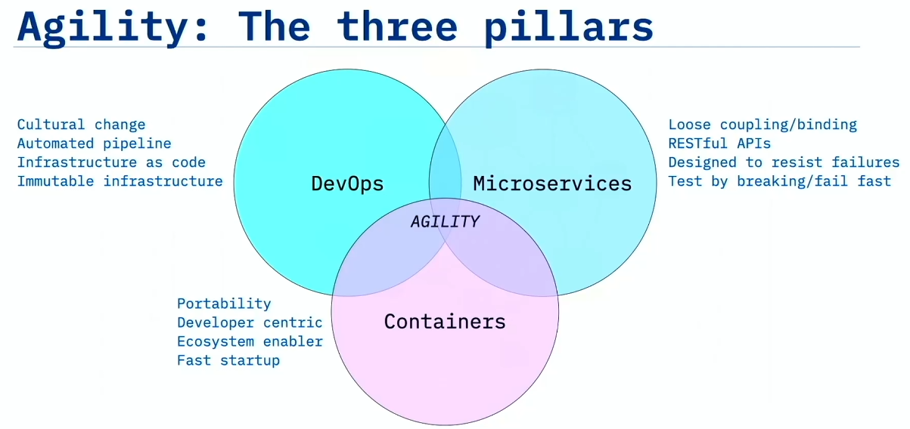
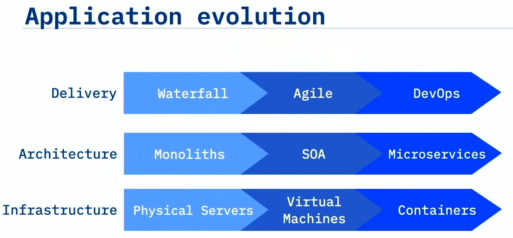
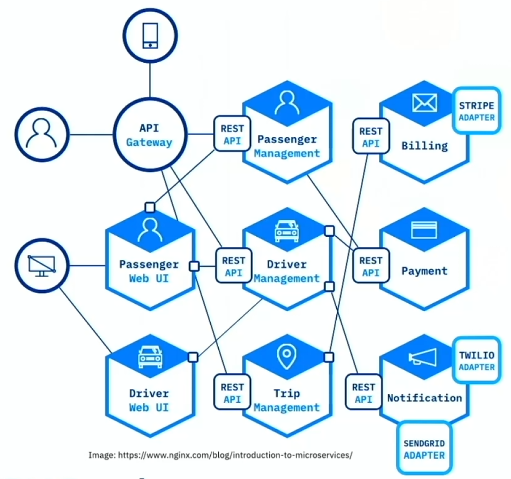

## Overview of DevOps

### Intro to DevOps

| **Category**                              | **Key Points**                                               |
| ----------------------------------------- | ------------------------------------------------------------ |
| **🔧 What is DevOps?**                     | - DevOps is **not** a tool or a job title - It’s a **collaborative practice** between development and operations - Follows **Lean and Agile** principles - Goal: **Rapid and continuous delivery** of software |
| **🌱 Why Culture Matters More Than Tools** | - **#1 reason DevOps fails**: Lack of organizational learning & cultural change - **Gartner**: 75% of initiatives fail due to these issues - **George Spafford**: “People-related factors… not technology” - **DORA Report (2021)**: Team culture has a big impact on success |
| **🔄 How to Change the Culture**           | **1. Think Differently** - Use social coding - Emphasize reuse and sharing - Lean ideas: small batches, MVPs for feedback  **2. Work Differently** - Use **TDD** and **BDD** - Ensure high-quality, repeatable processes - Implement **CI/CD** for shippable changes  **3. Organize Differently** - Team structure affects architecture - Avoid “reward theater”; promote real collaboration  **4. Measure Differently** - Change measurement systems - Avoid **vanity metrics** (e.g., lines of code) - Use **actionable metrics** that reflect customer/product value - “You get what you measure” |
| **💡 Final Advice**                        | - Foster **teamwork**, **accountability**, and **trust** - Be willing to **experiment and fail fast** - Every failure is a **learning opportunity** - Embrace change: *“We don’t do DevOps… we become DevOps.”* |

### Business Case for DevOps

| **Category**                        | **Key Points**                                               |
| ----------------------------------- | ------------------------------------------------------------ |
| **📉 Business Disruption & Urgency** | - Since 2000, **52% of Fortune 500 companies** are gone - The primary threat: **Disruption**, not competition - Disruption is inevitable: *“Not if, but when.”* |
| **📱 Disruption Examples**           | **Banks**: - Slow to adopt tech like check-deposit apps - Risk losing customers to faster-moving competitors  **Uber vs Taxi Industry**: - Tech (GPS, payments, smartphones) already existed - Innovation = **new business model**, not new tech - Taxis sought regulation instead of adapting |
| **📦 Disrupted Industries**          | - **Travel agents** replaced by online booking - **Point-and-shoot cameras** replaced by smartphones - **Blockbuster** failed to see they were in the **entertainment** business - **Netflix**: Pivoted from DVD rental to streaming and original content - **Garmin**: Shifted from mapping to fitness and tracking wearables |
| **💡 Key Takeaways**                 | - **Technology ≠ Innovation** - Tech is the **enabler**, not the **driver** of innovation - Success depends on **business model innovation**, then leveraging tech - Companies must **adapt or go extinct** |

### DevOps Adoption

| **Category**                          | **Key Points**                                               |
| ------------------------------------- | ------------------------------------------------------------ |
| **🧠 Cultural Shift Required**         | - DevOps requires **unlearning old habits**, especially in large enterprises - Startups adapt faster due to less legacy culture - Core idea: Embrace **failure**, **rollback quickly**, **limit blast radius** - Test in production via **A/B testing**, not theoretical guesses |
| **📦 Microservices & Design**          | - Apps like **Spotify** use microservices for flexibility - Components can be updated **independently** without full redeployment - Allows rapid delivery and experimentation with minimal impact |
| **🚀 Historical DevOps Milestones**    | **Flickr (2009)**: - John Allspaw & Paul Hammond: *“10+ Deploys per Day”* - Dev & Ops collaboration enabled fast, partial deployments  **Etsy (2011)**: - 517 deploys in 1 month by 76 devs - Deployment every ~25 minutes - Success due to **trust, transparency, communication, discipline** |
| **🏢 DevOps in the Enterprise (2016)** | - **DevOps Enterprise Summit** showed enterprise success stories: • Ticketmaster: 98% ↓ in mean time to recovery • Nordstrom: 20% shorter lead time • Target: Full stack deploy from 3 months → minutes • USAA: Release cycle from 28 → 7 days • ING: 500 teams doing DevOps • CSG: Incidents per release 200 → 18 |
| **💡 Key Takeaways**                   | - DevOps is **not a tool**, **not a box to buy** - True DevOps success is driven by **culture change** - Requires: **Trust, transparency, coordination, communication, and discipline** - Enterprises can do it too—not just “unicorn” startups |

### Definition of DevOps

| **Category**                    | **Key Points**                                               |
| ------------------------------- | ------------------------------------------------------------ |
| **📖 Origin & Definition**       | - Term **“DevOps”** coined in 2009 by **Patrick Debois** - Described as an extension of Agile into Operations - “Agile for Ops” = Dev & Ops working together, not in silos - Definition: DevOps is the **practice of Dev and Ops engineers working together** throughout the **entire software lifecycle**, applying **Lean and Agile** principles to deliver software **rapidly and continuously** |
| **🏗️ Characteristics of DevOps** | - **Culture of collaboration** with openness, trust, transparency - Requires **new app design**: not monolithic, but **microservices** - Needs **automation** to handle microservices deployment - Requires a **dynamic, programmable platform** for fast, on-demand environments |
| **🚫 What DevOps is NOT**        | - ❌ Just Dev + Ops working together - ❌ A **separate team** or a new “DevOps Team” - ❌ A **tool** (though tools support DevOps) - ❌ Just automation or hiring a “DevOps engineer” - DevOps is not a **one-size-fits-all** approach—strategy depends on the type of product (e.g., SaaS, shrink-wrap, installables) |
| **💡 Key Takeaways**             | - DevOps is a **cultural change**, not a toolset - Requires **one team**, **one mindset**, and **one set of measurements** - Tools reinforce DevOps culture but **do not create it** |

### Essential Characteristics of DevOps

| **Category**                                   | **Key Points**                                               |
| ---------------------------------------------- | ------------------------------------------------------------ |
| **🎯 DevOps Goal**                              | - The ultimate goal: **Agility** - Move with **maximum velocity** and **minimum risk** - Enable **smart experimentation** and fast customer feedback |
| **🌩️ Three Pillars of Agility (Perfect Storm)** | 1. **DevOps** • Culture change • Automated pipelines • Infrastructure as code • Immutable infrastructure  2. **Microservices** • Loosely coupled design with REST APIs • Designed to fail fast and resist failure  3. **Containers** • Developer-centric and fast startup • Ephemeral, portable, disposable environments |
| **📈 Application Evolution**                    | - Waterfall → Agile → DevOps - Monoliths → SOA → Microservices - Physical servers → VMs → Containers - DevOps built on **services + cloud + automation** |
| **📊 DevOps Dimensions**                        | 1. **Culture** (most important) 2. **Method** 3. **Tools** (what vendors mostly sell)  • Many fail by focusing only on tools, not culture |
| **🔁 Changing Culture**                         | - Change the way people **think**, **work**, **organize**, and **are measured** - Embrace social coding, small batches, TDD, and BDD - Culture must be led **top-down** and adopted **bottom-up** - “You get what you measure” — redefine success metrics |
| **💡 Key Takeaways**                            | - DevOps includes: **cultural change, automation, infrastructure as code, microservices, containers, immutable infra** - Culture is the **#1 success factor** (Atlassian) - True DevOps transformation = thinking, working, organizing, and measuring differently |

### Leading Up to DevOps

| **Category**                                 | **Key Points**                                               |
| -------------------------------------------- | ------------------------------------------------------------ |
| **📜 The Waterfall Method**                   | - Development proceeded in strict **phases**: Requirements → Design → Code → Test → Deploy - Each phase had **entrance/exit criteria**, preventing backward movement - Designs took months; development and testing also isolated and lengthy |
| **⛔ Major Problems with Waterfall**          | - **No room for change** once a phase ended - **No intermediate delivery** or feedback - High risk: Problems only discovered **at the end** - **Siloed teams**: Designers, Developers, Testers, and Ops worked separately - **Operations team**, furthest from the code, had to deploy and maintain it |
| **💣 Consequences of the Waterfall Approach** | - Long lead times and delivery delays - Mistakes discovered late were **very costly** to fix - **Lost information** between handoffs across teams - **Frustration**, **blockers**, and **inefficiency** were common |
| **💡 Key Takeaways**                          | - Waterfall fostered silos between Dev and Ops - DevOps emerged as a response to these pain points, promoting collaboration and iterative delivery |

### XP, Agile, and Beyond

| **Category**                    | **Key Points**                                               |
| ------------------------------- | ------------------------------------------------------------ |
| **🧪 Extreme Programming (XP)**  | - Introduced by **Kent Beck** in 1996 - Emphasized **tight feedback loops**: from months (release plans) to seconds (coding) - Focused on **software quality**, fast feedback, and iteration - Promoted **pair programming** for knowledge sharing and code quality |
| **⚡ Agile Manifesto (2001)**    | - Created by 17 developers at Snowbird, Utah - Core values: • Individuals & interactions > Processes & tools • Working software > Comprehensive documentation • Customer collaboration > Contract negotiation • Responding to change > Following a plan |
| **📈 Agile Practices**           | - **Self-organizing**, cross-functional teams - Work in **sprints** with adaptive planning - Encourages **early delivery**, **continuous improvement**, and **rapid response to change** |
| **🚧 The Problem: Agile vs Ops** | - Agile Devs moved fast, but Ops processes were slow - Example: Dev team ready in Feb, but VMs delivered in Sept - Tickets, long wait times, and process bottlenecks slowed delivery |
| **🐢 Two-Speed IT & Shadow IT**  | - **Two-Speed IT**: Devs are fast, Ops are slow - Devs bypass IT using the **cloud** to get resources - Leads to **Shadow IT** (IT infrastructure unknown to official IT department) |
| **💡 Key Takeaways**             | - XP led to Agile; Agile improved Dev velocity - **Agile alone is not enough** without making Ops agile too - This gap led to the need for **DevOps**—to align Dev and Ops for speed and collaboration |

### Brief History of DevOps

| **Category**                             | **Key Points**                                               |
| ---------------------------------------- | ------------------------------------------------------------ |
| **📅 Timeline of Key Events (2007–2019)** | - **2007**: Patrick Debois notices Dev & Ops disconnect - **2008**: Andrew Shafer hosts “Agile Infrastructure” BoF at Agile Conference (misses his own session, Debois shows up!) - **2009**: John Allspaw’s “10+ Deploys per Day” talk at Velocity - **2009**: First **DevOpsDays** held in Ghent, Belgium—term "DevOps" coined - **2010**: Jez Humble & David Farley publish *Continuous Delivery* book - **2013**: Gene Kim et al. publish *The Phoenix Project* - **2015**: Nicole Forsgren, Gene Kim, Jez Humble found **DORA** - **2016**: *The DevOps Handbook* published by Kim, Humble, Debois, Willis - 40+ DevOpsDays events across 21 countries in 10 years |
| **📚 Influential Publications**           | - *Continuous Delivery* (2010) – defined principles for automation & rapid delivery - *The Phoenix Project* (2013) – IT transformation through lean principles - *The DevOps Handbook* (2016) – practical DevOps implementation guide |
| **👤 Key Influencers**                    | - **Patrick Debois** – “Father of DevOps”, founded DevOpsDays - **Andrew Clay Shafer** – sparked Agile Infrastructure conversation - **John Allspaw** – Velocity talk popularized DevOps practice - **Jez Humble** – co-authored major books, DORA co-founder - **Gene Kim** – Phoenix Project author, DORA - **Nicole Forsgren** – DORA CEO, key research on performance metrics - **John Willis** – DevOpsDays organizer, Docker/Chef, co-author - **Bridget Kromhout** – DevOpsDays lead (2015–2020), *Arrested DevOps* podcast |
| **💡 Core Message**                       | - DevOps is a **grassroots movement**, **by practitioners** - It is not a product or job title - Focuses on **cultural transformation**, **collaboration**, and **measurement** - A response to real-world roadblocks in Dev + Ops collaboration |

### Summary

- **Technology is the enabler of innovation**, rather than the driver of innovation. You must have an innovative business idea to leverage technology.
- In 2009, John Allspaw described an innovative approach to managing development and operations that enabled Flickr to complete over ten deploys per day, when many companies were completing fewer than one deploy every six months. This was a key moment in the growth of DevOps.
- DevOps is the practice of development and operation engineers working together during the entire development lifecycle, following Lean and Agile principles that allow them to deliver software in a rapid and continuous manner.
- DevOps is not it is not just Dev and Ops working together. It is a cultural change and a different way to work. DevOps has three dimensions: culture, methods, and tools. Of these, culture is the most important.
- The essential characteristics of DevOps include cultural change, automated pipelines, infrastructure as code, immutable infrastructure, cloud native application design, the ecosystem of containers, and how to deploy with immutable infrastructure.
- DevOps started in 2007 when Patrick Debois and Andrew Clay Shafer began to gather like-minded people together at conferences to talk about common experiences.
- In 2009, Allspaw delivered his now famous “10+ Deploys Per Day – Dev and Ops Cooperation at Flickr” presentation and the idea gained ground. Also in 2009, Patrick Debois started a conference called DevOpsDays that helped spread the DevOps message.
- Books such as Continuous Delivery in 2010, The Phoenix Project in 2013, and The DevOps Handbook in 2016, helped practitioners understand how DevOps worked.
- The major influential people of the early DevOps movement: Patrick Debois, Andrew Clay Shafer, John Allspaw, Jez Humble, Gene Kim, John Willis, Bridget Kromhout, and Nicole Forsgren, went out and made a difference, showing the results that could be achieved with DevOps.
- The message spread from practitioner to practitioner until they began to realize what was possible with DevOps and that it was a better way to work.

## Thinking DevOps

### Social Coding Principles

| **Category**                          | **Key Points**                                               |
| ------------------------------------- | ------------------------------------------------------------ |
| **🌐 What is Social Coding?**          | - Think: *“Open Source for Inner Source”* - Code is developed **communally**, even in enterprises - Everyone is encouraged to **fork, contribute, and reuse** internal code - Reduces duplicate work and promotes **code sharing** and **collaboration** |
| **🔁 Problem Solved by Social Coding** | - In traditional closed repos: code is invisible, reused less - Teams often **rebuild code** just to get minor changes - Social coding enables forking + contributing instead of rewriting |
| **✅ How It Works**                    | - Discuss changes with repo owner → fork → create a branch → implement → submit **pull request** - Owner reviews, requests changes/tests if needed, then merges - Maintains **control** + encourages contributions = win-win |
| **👥 Pair Programming**                | - Originated from **Extreme Programming (XP)** - Involves **two people** at one workstation: • **Driver**: types code • **Navigator**: reviews, plans, and strategizes - Switch roles every ~20 minutes |
| **🔥 Benefits of Pair Programming**    | - **Higher code quality** - Bugs are found earlier via **"programming out loud"** - **Knowledge transfer** between junior and senior devs - **Shared code ownership**: avoids single points of failure - Better team alignment and reduced long-term maintenance costs |
| **💡 Key Takeaways**                   | - Social coding enables code **reuse**, contribution, and **collaboration** - Pair programming improves code quality and **creates better programmers** by sharing insights and knowledge |

### Git Repository Guidelines

| **Category**                       | **Key Points**                                               |
| ---------------------------------- | ------------------------------------------------------------ |
| **📁 Repository Structure**         | - Create **one repository per component or microservice** - Avoid **mono repos** (multiple microservices in one repo) - Keeps checkouts lightweight and focused on relevant code |
| **🌿 Branching Strategy**           | - Use **feature branches**: create a new branch for each issue - Avoid **long-lived branches** (e.g., old-style `development` branches) - Git branches are **lightweight** and should be deleted after merge |
| **🔁 Git Feature Branch Workflow**  | 1. **Create or fork** a repo 2. **Clone** to local machine 3. **Create a feature branch** tied to a GitHub Issue 4. Make changes locally 5. **Push to remote** and open a **pull request (PR)** 6. **Another team member reviews and merges** the PR into `master` |
| **🧑‍🤝‍🧑 Code Review Best Practices** | - **Never merge your own pull request** - Always have **someone else** review and merge - Pull requests = **code review opportunities** - Ensures **higher code quality** and team alignment |
| **💡 Key Takeaways**                | - One repo per component - Use **Git Feature Branch Workflow** - PRs should be reviewed and merged by peers - Every PR is a chance to improve code through review |

### Working in Small Batches

| **Category**                      | **Key Points**                                               |
| --------------------------------- | ------------------------------------------------------------ |
| **📁 Repository Structure**        | - Create **one repository per component or microservice** - Avoid **mono repos** that group multiple microservices together - Keeps checkouts minimal and relevant |
| **🌿 Branching Strategy**          | - Use **feature branches** for every issue - Avoid long-lived branches like `development` - Branches are **lightweight** and should be deleted after merging |
| **🔁 Git Feature Branch Workflow** | 1. Create or fork a GitHub repo 2. Clone it locally 3. Create a feature branch linked to a GitHub Issue 4. Make and commit changes locally 5. Push to remote and open a **pull request (PR)** 6. Another teammate reviews and merges into `master` |
| **👀 Code Review Best Practices**  | - **Do not merge your own PR** - Always have another team member do the review and merge - Every PR is an opportunity for **peer review and feedback** |
| **💡 Key Takeaways**               | - Follow the **Git Feature Branch Workflow** - Keep repos **modular**, branches **short-lived**, and **pull-reviewed** - Promote **team visibility and collaboration** through PRs |

### Minimum Viable Product (MVP)

| **Category**            | **Key Points**                                               |
| ----------------------- | ------------------------------------------------------------ |
| **🧪 What is an MVP?**   | - MVP = **Minimum Viable Product** - Not the same as Phase 1 or a beta release - It’s the **cheapest, fastest experiment** to test a **value hypothesis** and gain **learning** |
| **🎯 Purpose of an MVP** | - Goal: **Learn** what the customer really wants—not just deliver - Each MVP should help decide: **Pivot or Persevere?** - Use MVPs to gather feedback and improve progressively |
| **🚫 Wrong Approach**    | - Iterative delivery without feedback is **not** MVP - Example: Delivering car parts one by one without usability or learning (wheel → chassis → car) = wasted effort and no insights |
| **✅ Right Approach**    | - MVPs should be **usable**, **testable**, and focused on feedback - Example: Start with skateboard → add steering → add pedals → evolve to motorcycle → convertible - Customer journey shifts based on **real feedback**, not initial assumption |
| **📚 Key Mindset**       | - MVPs are **experiments**, and **failure is acceptable** - The value comes from **what you learn**, not what you deliver - Ask: “What did we learn? What should we try next?” |
| **💡 Key Takeaways**     | - An MVP is a **learning tool**, not just a product slice - Use MVPs to **test, adapt**, and move toward what the **customer truly desires** - In DevOps, MVPs reduce risk and improve customer alignment |

### Test Driven Development 

| **Category**                                 | **Key Points**                                               |
| -------------------------------------------- | ------------------------------------------------------------ |
| **🧪 What is Test-Driven Development (TDD)?** | - Write tests **before** writing code - Test cases **drive the design** of the code - You write tests for how the code **should behave**, then implement just enough code to pass them |
| **🔁 TDD Workflow – Red, Green, Refactor**    | 1. **Red** – Write a failing test 2. **Green** – Write code to pass the test 3. **Refactor** – Improve the code without changing its behavior 4. Repeat |
| **⚙️ Benefits of TDD**                        | - Forces **caller’s perspective**: you consider usability before writing code - Produces **higher-quality code** - **Defects found earlier**, saving debugging time - Ensures that **future changes don’t break functionality** |
| **📉 Common Excuses (and Why They're Wrong)** | - “I already know my code works” → But others (including future you) won’t - “I don’t write broken code” → Dependencies and environments change - “I don’t have time” → TDD **saves time** in the long run |
| **🚀 Why TDD Matters for DevOps**             | - Automated tests are **critical for CI/CD pipelines** - You **can’t safely deploy continuously** without automated testing - TDD gives **confidence** to refactor, deploy, and scale safely |
| **💡 Key Takeaways**                          | - TDD = write test → write code → refactor - Encourages better design and behavior-driven development - Essential for maintaining **automated, high-quality DevOps pipelines** |

### Behavior Driven Development

| **Category**           | **Key Points**                                               |
| ---------------------- | ------------------------------------------------------------ |
| **🔍 What is BDD?**     | - **Behavior-Driven Development (BDD)** focuses on **system behavior** from the **outside in** - Useful for **integration testing** and ensuring business outcomes are met - Contrast with TDD, which focuses on **unit-level correctness** from the **inside out** |
| **🔁 BDD vs TDD**       | - **BDD:** Are we building the **right thing**? - **TDD:** Are we building the thing **right**? - BDD = behavior from consumer’s view; TDD = logic from developer’s view |
| **🧠 How BDD Works**    | 1. **Collaboration** between devs, testers, and customers 2. Define behaviors using **Gherkin syntax** (Given, When, Then) 3. Use tools like **Cucumber**, **Behave**, or **jBehave** to turn those into automated tests |
| **🗣️ Gherkin Syntax**   | - **Given**: Precondition or starting context - **When**: Triggering action - **Then**: Expected outcome - **And**: Additions to Given/When/Then lines - Written in **natural language** understandable by all stakeholders |
| **📄 Example Scenario** | **Feature**: Returns go to stock **As a** store owner **I need** to add items back to stock when they're returned So that I can keep track of my stock on hand  **Scenario 1**: Refunded items should be returned to stock **Given** that a customer previously bought a black sweater from me **And** I have 3 black sweaters in stock **When** they return the black sweater for a refund **Then** I should have 4 black sweaters in stock |
| **✅ Benefits of BDD**  | - Improves **team communication** - Aligns **developers and stakeholders** on expectations - Enables **executable documentation** and **automated tests** from user stories - Ensures clear definition of **“done”** - Helps automate testing early, even **before development starts** |
| **💡 Key Takeaways**    | - BDD uses **plain language** + automated tests - Ensures you build what the **user actually needs** - Encourages shared understanding and lowers communication barriers |

### Cloud Native Microservices

| **Category**                                    | **Key Points**                                               |
| ----------------------------------------------- | ------------------------------------------------------------ |
| **☁️ What is Cloud Native Microservices?**       | - **Cloud native** = applications designed to run and scale in the cloud - Built as a collection of **independent microservices** - Each service is focused on a **single business domain** - Services communicate via **REST APIs**, not shared databases |
| **🧱 Microservices vs Monolith**                 | - **Monolith**: tightly coupled; shared databases; hard to scale pieces independently - **Microservices**: loosely coupled; each has its **own database**; independently deployable and scalable |
| **🔄 Stateless Microservices**                   | - “Stateless” = no **internal hidden state** stored in memory - State is persisted externally (e.g., DB or object-store) - Enables scalability, resilience, and fault tolerance |
| **🚀 Benefits of Microservices Architecture**    | - **Independent deployment**: Update one service without affecting others - **Independent scalability**: Scale specific services (e.g., notifications) without scaling the whole system - **Fault tolerance**: Failed instances are killed and respawned (“**cattle not pets**”) |
| **📚 Microservices Principles (Fowler & Lewis)** | - Each service runs in its own process - Communicates using **lightweight mechanisms** like HTTP/REST - Built around **business capabilities** - Fully automatable deployment (CI/CD) is essential |
| **📐 12-Factor App Guidelines**                  | - Originated from **Heroku** - Standard for building **cloud native, stateless services** - Emphasizes configurability, portability, and scalability |
| **💡 Key Takeaways**                             | - Cloud-native = microservices + stateless + REST APIs + independent DBs - Microservices allow **faster changes**, **team autonomy**, and **DevOps-driven deployment** - Enables **true continuous delivery** by reducing system-wide coupling |

- Cloud native architecture is a collection of independently deployable microservices
- Stateless microservices each maintain their own state in a separate database or persistent object store
- Microservices are loosely coupled services, designed for scalability and communication with APIs

### Designing for Failure

| **Category**                  | **Key Points**                                               |
| ----------------------------- | ------------------------------------------------------------ |
| **⚠️ Embracing Failure**       | - In distributed systems, **failure is inevitable** - Goal: **Recover quickly**, not avoid all failure - Shift from “mean time to failure” → “mean time to recovery” - Developers must **build resilience** into the application, not just rely on Ops |
| **🔁 Retry Pattern**           | - Handle **transient failures** (e.g., temporary outages) - Retry failed operations with **exponential backoff** (1s → 2s → 4s...) - Prevents overwhelming the service and gives time to recover - Required for **cloud-native resilience**, e.g., DB startup delays or throttling (HTTP 429) |
| **⚡ Circuit Breaker Pattern** | - Prevents **cascading failures** - When error rate exceeds threshold, **open the circuit** to stop further calls - Automatically transitions to **half-open** state to test recovery - Resets to **closed** if successful, else stays **open** - Inspired by electrical circuit breakers |
| **🚪 Bulkhead Pattern**        | - Isolates components using **thread pools** or containers - Failure in one service/thread pool **won’t affect others** - Inspired by ship design: bulkheads keep compartments separate to prevent sinking |
| **🧪 Chaos Engineering**       | - Practice of **intentionally breaking things** to test system resilience - Netflix’s **Chaos Monkey** kills random services to observe recovery - Helps validate resilience patterns like retries, circuit breakers, etc. |
| **💡 Key Takeaways**           | - Failure is **expected**; resilience must be **designed in** - Use patterns: **Retry**, **Circuit Breaker**, **Bulkhead** - Use **chaos engineering** to test and prove system robustness under real failure conditions |

### Summary

- Social coding is coding as a community and public repositories and pair programming result in higher code quality. 
- Working in small batches reduces waste and means quickly delivering something useful to the customer. 
- Minimum viable product is as much about delivery as it is about building what the customer really desires. 
- Test-driven development is writing the test for the code you wish you had, then writing the code to make the test pass. It allows you to develop faster and with more confidence.
- Behavior-driven development focuses on the behavior of the system from the outside in. It looks at the system as a consumer of it. 
- Behavior-driven development improves communication by using an approachable syntax that developers and stakeholders can understand. 
- Microservices are built around business capabilities and are independently deployable by fully automated deployment machinery. 
- Cloud native architecture enables independently deployable microservices that take advantage of horizontal scaling and result in more resilient services. 
- Failure is inevitable, so we design for failure rather than trying to avoid failure. 
- It is important to embrace failure and quickly recover when failures happen. 

## Working DevOps

### Taylorism and Working in Silos

| **Category**                                      | **Key Points**                                               |
| ------------------------------------------------- | ------------------------------------------------------------ |
| **⚙️ What is Taylorism?**                          | - Named after **Frederick Winslow Taylor** (1911) - Originated from factory work during the industrial revolution - Promotes **command-and-control** management style - Work is broken into **task-specific roles** (e.g., assembly lines) - Managers plan, workers execute with little autonomy |
| **🏭 Impact of Taylorism on Modern IT**            | - Promotes **siloed teams**: project managers → architects → developers → testers → operations → security - Each handoff is a **risk point**: loss of context, mistakes, delays - Optimized for **repetition and mass production**, not for custom development |
| **👎 Why Taylorism Fails in Software Development** | - Software is **bespoke, knowledge-based craftwork**, not mass production - You often build things that **don’t exist yet**, unlike standardized car parts - Building one unique product ≠ justify assembly-line tooling - Requires **creativity, iteration, and collaboration**, not rigid silos |
| **🚫 Problems with Silos**                         | - Causes **bottlenecks**, slow feedback loops, and high error rates - Encourages blame and communication breakdown - Each team works with different goals, reducing overall effectiveness |
| **✅ DevOps Culture vs Taylorism**                 | - DevOps promotes **teaming and collaboration**, not separation - Automate relentlessly, minimize manual work - Embrace **small, frequent releases** for rapid feedback and risk reduction - Managers should empower, not micromanage ("Hire smart people so they can tell us what to do") |
| **💡 Key Takeaways**                               | - **Abandon Taylorism** and command-and-control for DevOps success - Treat software like **craftwork**, not factory output - Break down silos, empower teams, and enable continuous learning and delivery |

### Software Engineering vs. Civil Engineering

| **Category**                                               | **Key Points**                                               |
| ---------------------------------------------------------- | ------------------------------------------------------------ |
| **🏗️ Civil Engineering Approach**                           | - Follows a **waterfall-like model**: • Architect → Blueprint → Construction → Maintenance - Each role completes their task and then **moves on** - Once built, structures are **stable** and rarely change - Works well for physical systems where change is minimal |
| **💻 How Software Differs**                                 | - Software is **organic and always evolving** - Even if the app doesn’t change, OS patches, package updates, and security fixes constantly affect it - **New features** are continuously added — unlike buildings, you *do* add new “floors” to software |
| **🚧 The Problem with Treating Software Like Construction** | - Teams throw deliverables over the wall: Architect → Dev → QA → Ops - Leads to **lack of ownership** and **context loss** - Once the project is “done,” the team disbands and knowledge fades - Operations must handle future changes alone |
| **📉 Flaws of the Project Model**                           | - The **“project complete → move on”** mindset fails in software - It ignores the **constant change** and **need for iteration** - Creates code without long-term stewardship or enhancement vision |
| **✅ DevOps/Product Thinking**                              | - Treat software like a **product**, not a project - Maintain **long-lived teams** with **end-to-end ownership** - Developers who build the system also **maintain and evolve it** - This results in higher quality, better ideas, and sustained improvement |
| **💡 Key Takeaways**                                        | - Software is **never done**; it evolves - Abandon civil engineering-style handoffs - Embrace **stable teams**, **continuous enhancement**, and **product ownership** for long-term success in DevOps |

### Required DevOps Behaviors

| **Category**                           | **Key DevOps Behaviors**                                     |
| -------------------------------------- | ------------------------------------------------------------ |
| **🤝 Collaboration & Shared Ownership** | - Break down silos between Dev, QA, and Ops - Encourage **cross-functional teams** - Teams share responsibility for **quality, delivery, and reliability** |
| **🔁 Continuous Improvement**           | - Always look for ways to improve **processes and outcomes** - Conduct **blameless postmortems** - Implement feedback from incidents, deployments, and users |
| **🚀 Rapid, Frequent Delivery**         | - Deliver small, **incremental changes** often - Reduce batch size and scope of releases - Use **CI/CD pipelines** to automate deployment |
| **📈 Metrics-Driven Culture**           | - Use **measurable goals** to guide improvements (e.g., deployment frequency, lead time, MTTR) - Make decisions based on **data, not opinions** - Continuously monitor system health |
| **⚙️ Automation-First Mindset**         | - Automate repetitive tasks (testing, deployment, monitoring) - Improve consistency, reduce human error - Infrastructure as Code (IaC) for managing environments |
| **🔐 Security as Code (DevSecOps)**     | - Build security into the pipeline from the start - Automate security tests - Encourage collaboration between Dev, Ops, and Security teams |
| **🧪 Experimentation & Learning**       | - Promote a **safe-to-fail** environment - Encourage **experimentation** and innovation - Treat failures as learning opportunities |
| **👥 Empathy & Respect**                | - Practice **blameless culture** - Respect different team roles and perspectives - Prioritize **psychological safety** to foster open communication |

### Infrastructure as Code

| **Category**                                | **Key Points**                                               |
| ------------------------------------------- | ------------------------------------------------------------ |
| **💻 What is Infrastructure as Code (IaC)?** | - Describes **infrastructure using executable text/code** - Not documentation — real **code** that can be executed by tools - Tools: **Ansible**, **Puppet**, **Chef**, **Terraform**, **Docker**, **Kubernetes** |
| **⚙️ Benefits of IaC**                       | - **Repeatable** and **automated** setups - **Version-controlled** infrastructure - Prevents manual misconfiguration and **server drift** - Enables consistent environments across dev, test, prod |
| **🌩️ Ephemeral Infrastructure**              | - Infrastructure is **transient** and created **on demand** - No more hand-crafted long-living servers - Example: spin up test environment → use it → destroy it - Makes infrastructure **disposable and reproducible** |
| **🐄 "Cattle, Not Pets"**                    | - Don’t treat servers as unique or irreplaceable - If a server (or container) fails, just replace it - Avoid manual fixes; always **recreate from template/code** |
| **📦 Immutable Delivery via Containers**     | - Use **Docker** or similar tools to package apps + dependencies - Changes are made to **images**, not running containers - Enables **consistent deployment** from dev to prod - If issues occur, **rollback is instant** by replacing containers |
| **🔄 Rolling Updates & Rollbacks**           | - Deploy new version as a **new container** - If stable → promote it to production - If failure → **stop and replace** with previous container - Avoid patching live containers—**redeploy from updated image** |
| **💡 Key Takeaways**                         | - IaC = infrastructure as code, not scripts - Enables **automation, reproducibility, and consistency** - Treat infrastructure and containers as **ephemeral**, not permanent - Use versioned templates and images for control and rollback |

### Continuous Integration

| **Category**                               | **Key Points**                                               |
| ------------------------------------------ | ------------------------------------------------------------ |
| **🔄 What is Continuous Integration (CI)?** | - CI = **Building, testing, and integrating every developer change** into the master/main branch - Each commit triggers **automated tests and builds** - Ensures the master branch is **always in a deployable state** |
| **🚀 What is Continuous Delivery (CD)?**    | - CD = Ensures code can be rapidly and safely **deployed to a production-like environment** - Often confused with CI, but is a **separate practice** - Real production deployment = **Continuous Deployment** |
| **⚒️ How CI Works**                         | - Developers use **short-lived branches** - Changes are merged via **pull requests** after **tests pass** - Pull requests trigger **automated builds and tests** - Merge only after all tests succeed |
| **💥 Problems with Traditional Dev**        | - **Long-lived branches** cause merge conflicts - Teams delay integration, leading to **broken builds** and **delays** - Old VCS made branching expensive, but Git solves this |
| **📦 Why Small Batches Matter**             | - Frequent commits reduce **conflict risk** - Smaller changes are easier to **review and test** - Avoids large, risky merges that take days to resolve |
| **🧪 Automation in CI**                     | - CI tools (GitHub Actions, Jenkins, Travis CI, etc.) automate: • Detecting code changes • Running builds • Running all tests - Ensures the **build is self-testing** |
| **👁️ Code Review via Pull Requests**        | - Every pull request is an opportunity for **peer review** - Improves code quality and team communication - Pull requests should **never be merged** with failing tests |
| **✅ Benefits of CI**                       | - Faster reaction time and delivery - Reduces integration risk - Encourages **clean, tested, and deployable code** - Boosts **collaboration and code ownership** - Makes **automated testing a standard** |
| **💡 Key Takeaways**                        | - CI = integrate and test **every change** - CD = deploy every change to a **prod-like environment** - Use **automation**, **short branches**, **pull requests**, and **tests** - The **master branch must always be deployable** |

### Continuous Delivery

| **Category**                                     | **Key Points**                                               |
| ------------------------------------------------ | ------------------------------------------------------------ |
| **🔁 What is Continuous Delivery (CD)?**          | - CD = Practice of ensuring software can be **released to production at any time** - Builds on Continuous Integration (CI) - The **master branch must always be deployable** - Code is automatically built, tested, and deployed to **production-like environments** |
| **📦 CI/CD Pipeline Components**                  | - **Code Repository** (e.g., GitHub) - **Build Server** (e.g., Travis CI, GitHub Actions) - **Integration/Orchestration Server** for automation - **Artifact Repository** (e.g., Docker registry, JAR repo) - **Deployment Configuration Tools** (e.g., Ansible, Kubernetes) |
| **🔧 Five Key Principles of Continuous Delivery** | 1. **Built-in Quality** – All changes go through automated tests 2. **Work in Small Batches** – Reduces risk, improves testability 3. **Automate Repetitive Tasks** – Let people focus on solving problems 4. **Relentless Improvement** – Measure and iterate 5. **Everyone is Responsible** – Broken builds are a team problem |
| **🚀 Continuous Deployment (CDP)**                | - Code is deployed **directly to production** after passing CI/CD - Also known as **“continuous release”** - Feature flags can control which parts are active |
| **🛡️ How DevOps Manages Risk**                    | - Deploy **early and often** to gain confidence - Use **feature flags** to control activation separately from deployment - Implement **blue-green deploys**, **canary testing**, and **zero downtime** strategies - Avoid manual deployments to prevent human error |
| **📊 CI vs CD vs CDP**                            | - **CI**: Build + test every change - **CD**: Deliver to pre-prod/staging environments - **CDP**: Auto-deploy to **production** - All aim to **shorten feedback loops** and **reduce failure impact** |
| **💡 Key Takeaways**                              | - CI/CD pipelines ensure fast, safe, and repeatable deployments - Continuous Delivery requires CI and focuses on release readiness - Deployment must be **automated**, **measured**, and **decoupled from activation** for reliability |

### Summary

- Taylorism was designed for factory work and software development is bespoke, that is, more like craftwork, and that working in silos leads to mistakes and bottlenecks. 
- Team ownership and stable teams make software development more like product development rather than project management. 
- Developers want innovation, while Operations want stability. 
- Required DevOps behaviors include shared ownership, collaboration, embracing change, and data-driven responses. 
- Infrastructure as Code is describing infrastructure in a textual executable format. 
- Ephemeral infrastructure can be used and then discarded because servers are built on demand, via automation, using Infrastructure as Code techniques. 
- Continuous Integration is building, testing, and integrating every developer change into the master branch after tests have passed. 
- The benefits of Continuous Integration include faster reaction time, moving faster, and reducing the risk in integrating code. 
- Continuous Delivery ensures that code can be rapidly and safely deployed to production by delivering every change to a production-like environment. 
- The five principles of Continuous Delivery have to do with quality, working in small batches, automation, continuous improvement, and shared responsibility.