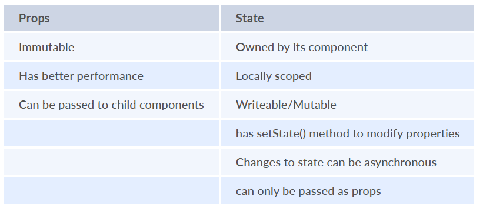
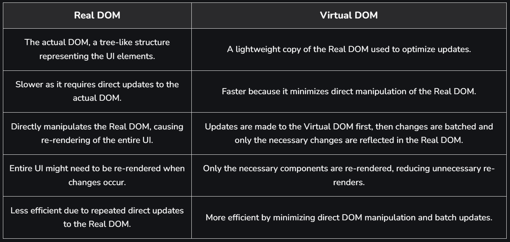
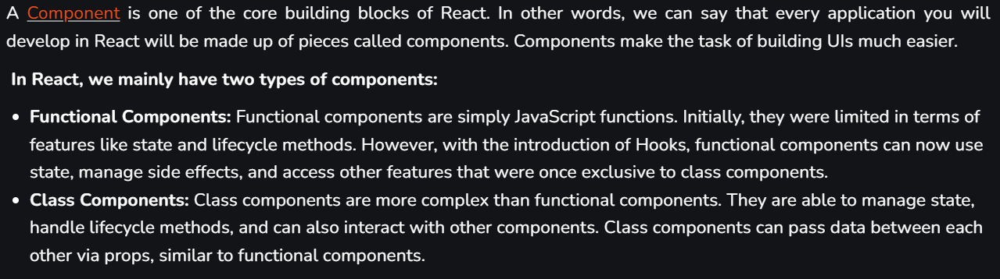
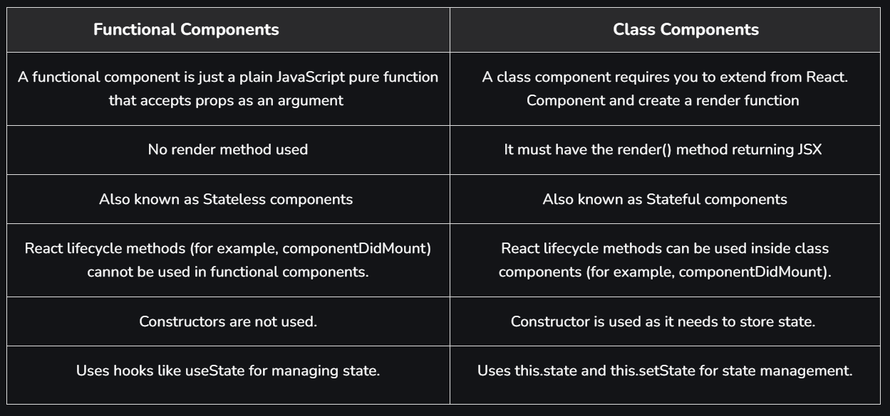

# ReactJS


## Important Features of React:

- **Virtual DOM:** React uses a virtual DOM to efficiently update and render components, ensuring fast performance by minimizing direct DOM manipulations. ***When changes occur, React updates only the necessary parts of the real DOM, instead of re-rendering everything.***
- **Component-Based Architecture:** React builds UI using reusable, isolated components, making code more modular, maintainable, and scalable.
- **Hooks**: React Hooks allow functional components to manage state and side effects, making them powerful and more flexible.
- **Server-Side Rendering (SSR)**: React can be used for server-side rendering, where HTML content is generated on the server and sent to the client. This improves the app's performance, especially for SEO.
- **React Router**: React Router enables navigation in a React application. It allows you to define different routes for different views in a single-page application (SPA).

## Props and State



React allows us to pass information to a Component using something called props (which stands for properties). Props are objects which can be used inside a component

We can access any props inside from the component’s class to which the props is passed. The props can be accessed as shown below:

`this.props.propName;`


## Virtual DOM


## Real DOM and virtual DOM difference



## JSX

JSX is basically a syntax extension of regular JavaScript and is used to create React elements. These elements are then rendered to the React DOM. All the React components are written in JSX. To embed any JavaScript expression in a piece of code written in JSX we will have to wrap that expression in curly braces {}. 

## React Components



### ✅ Functional Component (with Hooks)

```jsx
jsxCopyEditimport React, { useState, useEffect } from 'react';

function Counter() {
  const [count, setCount] = useState(0);

  useEffect(() => {
    console.log('Component mounted or updated');
  }, [count]); // Only runs when `count` changes

  return (
    <div>
      <p>You clicked {count} times</p>
      <button onClick={() => setCount(count + 1)}>
        Click me
      </button>
    </div>
  );
}

export default Counter;
```

### 🧱 React Class Component = OOP Class

```jsx
import React, { Component } from 'react';

class Counter extends Component {
  constructor(props) {
    super(props);              // Calls the parent (Component) constructor
    this.state = { count: 0 }; // Initializes local state
  }

  componentDidUpdate() {
    console.log('Component updated');
  }

  render() {
    return (
      <div>
        <p>You clicked {this.state.count} times</p>
        <button onClick={() => this.setState({ count: this.state.count + 1 })}>
          Click me
        </button>
      </div>
    );
  }
}
```

#### shouldComponentUpdate()  - class 

In React, lifecycle methods provide hooks into different phases of a component's lifecycle, enabling developers to control its behaviour at various stages. One such lifecycle method is shouldComponentUpdate().

It plays an important role in optimizing component rendering and ensuring that unnecessary updates are avoided, improving the performance of React applications.

The shouldComponentUpdate() is a lifecycle method used in React class components to determine whether a component should re-render in response to changes in state or props. This method is invoked before every render and allows you to conditionally skip the re-rendering process, which can help optimize performance by preventing unnecessary updates.

- If shouldComponentUpdate() returns true, the component re-renders.
- If it returns false, the component does not re-render.

```jsx
import React, { Component } from "react";

class Counter extends Component {
    constructor() {
        super();
        this.state = {
            count: 0,
        };
    }

    shouldComponentUpdate(nextProps, nextState) {
        if (nextState.count === this.state.count) {
            return false;
        }
        return true;
    }

    increment = () => {
        this.setState({ count: this.state.count + 1 });
    };

    render() {
        console.log("Counter component re-rendered");
        return (
            <div style={{ textAlign: "center" }}>
                <p>Count: {this.state.count}</p>
                <button onClick={this.increment}>Increment</button>
            </div>
        );
    }
}

export default Counter;
```

- The Counter component has a shouldComponentUpdate() method that checks if the count state has changed.
- If the count is the same as before, the component does not re-render, saving resources.
- Only when the count changes will the component re-render.

### Difference



### React render

React renders HTML to the web page by using a function called render(). The purpose of the function is to display the specified HTML code inside the specified HTML element. In the render() method, we can read props and state and return our JSX code to the root component of our app.

## ReactJS Keys

A key serves as a unique identifier in React, helping to track which items in a list have changed, been updated, or removed. It is particularly useful when dynamically creating components or when users modify the list.

```jsx
const numbers = [1, 2, 3, 4, 5];
const updatedNums = numbers.map((number, index) =>
    <li key={index}>
        {number}
    </li>
);
```


## Data Binding

**Data binding** is a technique that binds data sources from the provider and consumer together and synchronizes them. In other words, Data Binding means sharing data between components to view and view to component.

- Data binding in React can be achieved by using a controlled input.
- A controlled input is achieved by binding the value to a state variable and an onChange event to change the state as the input value changes.

1 way data binding

```jsx
import React, { useState } from 'react';

function comp() {
    const [count, setCount] = useState(0);

    return (
        <div>
            <h1>Count: {count}</h1>
            <button onClick={() => setCount(count + 1)}>Incre</button>
        </div>
    );
}

export default comp;
```

2 ways data binding

```jsx
import React, { useState } from 'react';
import './App.css';

function App() {
    const [subject, setSubject] = useState("");

    const handleInputChange = (event) => {
        setSubject(event.target.value);
    };

    return (
        <div className="container">
            <h1>Two-Way Data Binding Example</h1>
            <div className="content">
                <input
                    type="text"
                    placeholder="Enter a subject..."
                    value={subject}
                    onChange={handleInputChange}  // Update state on change
                    className="input-field"
                />
                <p>Your selected subject is: <b>{subject || "___"}</b></p>
            </div>
        </div>
    );
}

export default App;
```

## useContext

`useContext` is a **React Hook** that allows functional components to **consume values from a context**, without writing deeply nested props (`props drilling`).

In large apps, passing data (like theme, user, language) down multiple component levels via props becomes messy. Context provides a **centralized way** to share data across the component tree.

### 1. Create Context

```jsx
import React, { createContext } from 'react';

export const ThemeContext = createContext('light');
```

### 2. Provide Context Value

```jsx
import React from 'react';
import { ThemeContext } from './ThemeContext';
import App from './App';

function Root() {
  return (
    <ThemeContext.Provider value="dark">
      <App />
    </ThemeContext.Provider>
  );
}
```

### 3. Consume Context using `useContext`

```jsx
import React, { useContext } from 'react';
import { ThemeContext } from './ThemeContext';

function App() {
  const theme = useContext(ThemeContext);
  return <div>The current theme is {theme}</div>;
}
```

------

###  Summary Table

| Feature         | Description                              |
| --------------- | ---------------------------------------- |
| `createContext` | Creates a Context object                 |
| `Provider`      | Supplies the context value               |
| `useContext`    | Hook to access context inside components |

### Best Practices

- Keep context **only for global/shared state** (e.g., theme, user, auth).
- Avoid putting **frequently changing state** (like mouse position) in context — it causes many re-renders.

