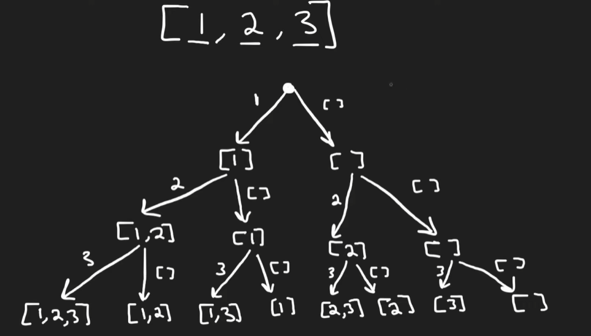
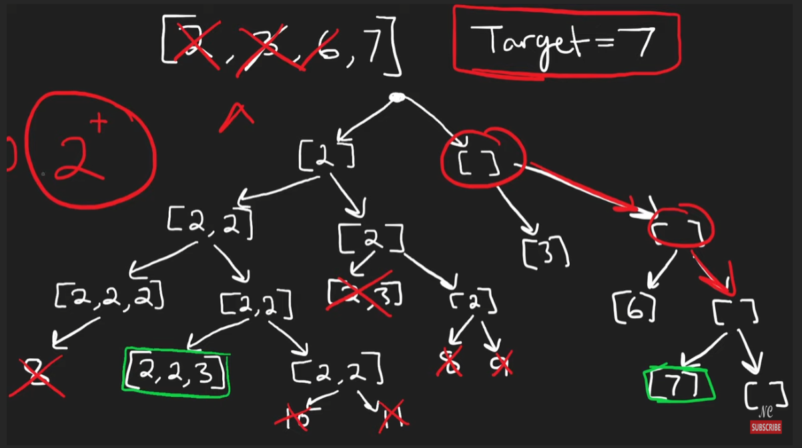

## Backtracking - Basic

```python
ans = []
def dfs(start_index, path, [...additional states]):
    if is_leaf(start_index):
        ans.append(path[:]) # add a copy of the path to the result
        return
    for edge in get_edges(start_index, [...additional states]):
        # prune if needed
        if not is_valid(edge):
            continue
        path.add(edge)
        if additional states:
            update(...additional states)
        dfs(start_index + len(edge), path, [...additional states])
        # revert(...additional states) if necessary e.g. permutations
        path.pop()

```


## Backtracking - Aggregation

```python
def dfs(start_index, [...additional states]):
    if is_leaf(start_index):
        return 1
    ans = initial_value
    for edge in get_edges(start_index, [...additional states]):
        if additional states: 
            update([...additional states])
        ans = aggregate(ans, dfs(start_index + len(edge), [...additional states]))
        if additional states: 
            revert([...additional states])
    return ans

```

## Subsets



```java
Input: nums = [1,2,3]

Output: [[],[1],[2],[1,2],[3],[1,3],[2,3],[1,2,3]]
```

```python
class Solution:
    def subsets(self, nums: List[int]) -> List[List[int]]:
        res = []

        def backtrack(path, start):
            res.append(path[:])  # Add current subset (copy)

            for i in range(start, len(nums)):
                path.append(nums[i])               # Choose
                backtrack(path, i + 1)             # Explore (next element)
                path.pop()                         # Un-choose (backtrack)

        backtrack([], 0)
        return res
```

## * Combination Sum



```python
class Solution:
    def combinationSum(self, candidates: List[int], target: int) -> List[List[int]]:
        res = []

        def backtrack(path, remain, start):
            if remain == 0:
                res.append(path[:])
                return
            if remain < 0:
                return  # pruning

            for i in range(start, len(candidates)):
                path.append(candidates[i])
                backtrack(path, remain - candidates[i], i)  # reuse same element
                path.pop()

        backtrack([], target, 0)
        return res
```

## Combination Sum II

```python
class Solution:
    def combinationSum2(self, candidates: List[int], target: int) -> List[List[int]]:
        res = []
        candidates.sort()
        
        def backtrack(candidates, remaining, path, start):
            if remaining == 0:
                res.append(path[:])
                return
            elif remaining < 0: # prunning
                return

            for i in range(start, len(candidates)):
                # i > start, means we dont want to skip the first level in backtracking
                # in 3 sums, we use i > 0, but this case we also need to consider duplicates
                if i > start and candidates[i] == candidates[i - 1]:
                    continue
                path.append(candidates[i])
                backtrack(candidates, remaining - candidates[i], path, i + 1)
                path.pop()

        backtrack(candidates, target, [], 0)
        return res
```

There is also a faster approach, to learn

```python
def permute(self, nums: List[int]) -> List[List[int]]:
    self.res = []
    self.backtrack(nums, 0)
    return self.res

def backtrack(self, nums: List[int], idx: int):
    if idx == len(nums):
        self.res.append(nums[:])
        return
    for i in range(idx, len(nums)):
        nums[idx], nums[i] = nums[i], nums[idx]   # Swap
        self.backtrack(nums, idx + 1)
        nums[idx], nums[i] = nums[i], nums[idx]   # Swap back
```

## * Word Search

```python
class Solution:
    def exist(self, board: List[List[str]], word: str) -> bool:
        m, n = len(board), len(board[0])
        directions = [[-1, 0], [1, 0], [0, -1], [0, 1]]
        
        def dfs(r, c, index):
            if index == len(word):
                return True
            if not (0 <= r < m and 0 <= c < n):
                return False
            if board[r][c] != word[index]:
                return False
            
            temp = board[r][c]
            board[r][c] = "#"
            
            for dr, dc in directions:
                if dfs(r + dr, c + dc, index + 1):
                    return True
            
            board[r][c] = temp
            return False
        
        for i in range(m):
            for j in range(n):
                if dfs(i, j, 0):
                    return True
        return False
```

