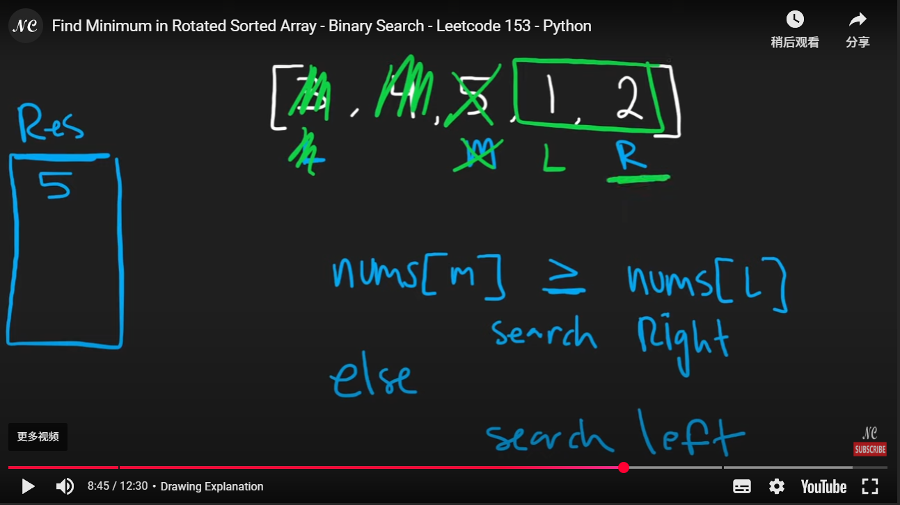
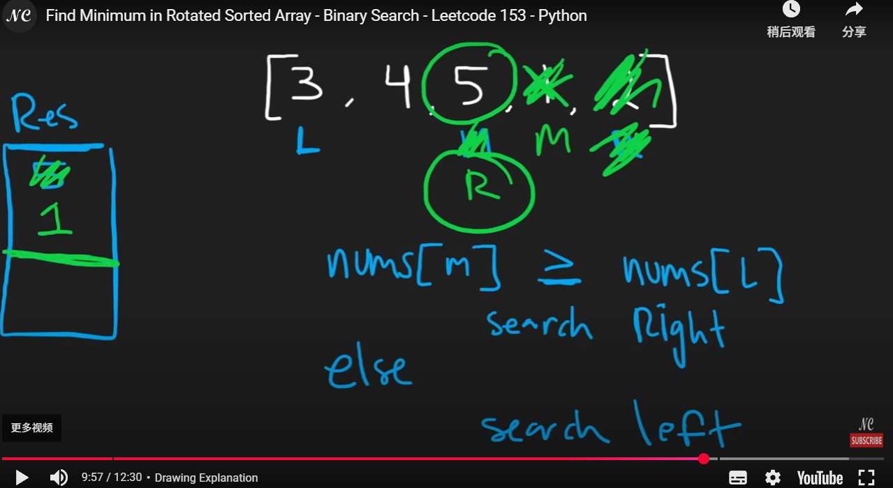
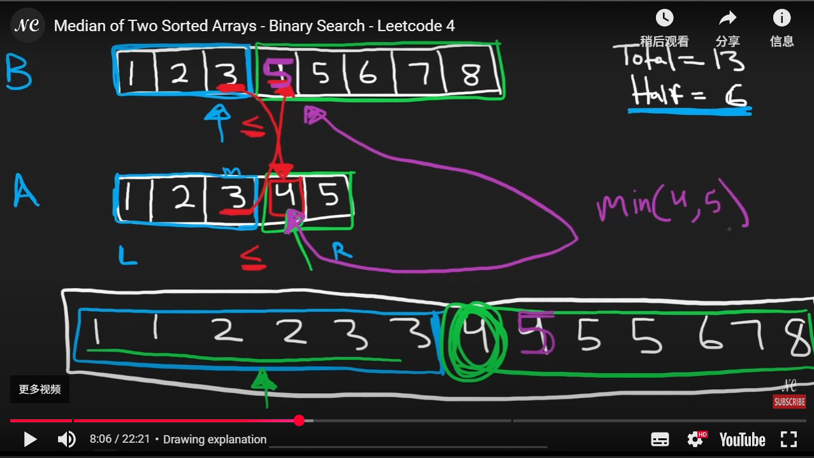
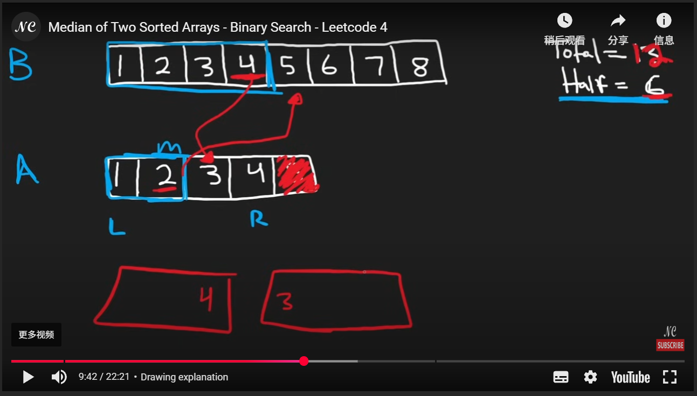
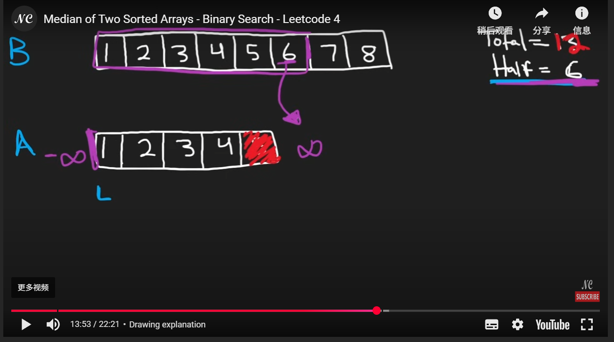

## Binary Search

```python
class Solution:
    def search(self, nums: List[int], target: int) -> int:
        # sorted -> binary search
        left = 0
        right = len(nums) - 1
        while left <= right:
            # mid = (left + right) // 2 # Possible overflow error
            mid = left + (right - left) // 2
            if nums[mid] == target:
                return mid
            elif nums[mid] < target:
                left = mid + 1
            else:
                right = mid - 1
        return -1

```

## Modified Binary Search

```python
def binary_search(arr: List[int], target: int) -> int:
    left, right = 0, len(arr) - 1
    first_true_index = -1 # notice sometimes we need to return the value, an empty value/string might be better
    while left <= right:
        mid = (left + right) // 2
        if feasible(mid):
            first_true_index = mid
            right = mid - 1
        else:
            left = mid + 1

    return first_true_index

```


## Search a 2D Matrix

We could use the 2D matrix property, first do binary search on the row. Compare the first index with target, if it is smaller, we know that we need to decrease our mid, if it is greater than the last index, then we increase our mid + 1. It will break if the row[0] <= target <= row[-1].

```python
class Solution:
    def searchMatrix(self, matrix: List[List[int]], target: int) -> bool:
        # a simple way would be just convert them to a 1D, but that would need more space, can we do better
        # binary search on matrix
        start, end = 0, len(matrix) - 1
        row = -1
        while start <= end:
            mid = (start + end) // 2
            if target > matrix[mid][-1]:
                start = mid + 1
            elif target < matrix[mid][0]:
                end = mid - 1
            else:
                break
        row = (start + end) // 2

        start, end = 0, len(matrix[0]) - 1
        while start <= end:
            mid = (start + end) // 2
            mid_val = matrix[row][mid]
            if mid_val == target:
                return True
            elif mid_val < target:
                start = mid + 1
            else:
                end = mid - 1
        return False
```


## Koko Eating Bananas

We need to do define a function that count the number of bananas. Sometimes it might take some time to come up the idea, for this case, we need to realize since we are trying to find the minimum number up to the max value with in the array. A modifies binary search converge to the max value would be solution in this case.

```python
class Solution:
    def minEatingSpeed(self, piles: List[int], h: int) -> int:
        # most intutive way is start searching from 0 until it exceeds the condition
        # start from lower increase by 1 till it stops

        max_k = max(piles) # O(n)
        low = 1

        # modified binary search on the mininum
        def count_bananas(k):
            count = 0
            for pile in piles:
                if pile % k != 0:
                    count += pile // k + 1
                else:
                    count += pile // k
            print(count)
            return count

        min_k = -1
        while low <= max_k:
            mid = (low + max_k) // 2

            if count_bananas(mid) <= h:
                min_k = mid
                max_k = mid - 1
            else:
                low = mid + 1
                
        return min_k
```


## Find Minimum in Rotated Sorted Array

1. The array is **partially sorted**, but **rotated at some pivot**.

2. We aim to search in the **sorted portion** where the minimum must lie.

3. **Observation:**

   - If `nums[l] < nums[r]`, the subarray `[l..r]` is already sorted → minimum is `nums[l]`.
   - If `nums[mid] < nums[r]`, the **right half** is sorted → minimum might be in the **left half**, including `mid`.
   - Else, the **left half** is sorted → minimum must be in the **right half** (excluding `mid`).

4. Keep narrowing the range based on which half is sorted.

   Always update `res` with the smallest seen so far: `res = min(res, nums[mid])`.





```python
class Solution:
    def findMin(self, nums: List[int]) -> int:
        # search in sorted array
        # always search on the smaller sorted portion, nums[m] < nums[r]
        
        l, r = 0, len(nums) - 1
        res = nums[l]

        while l <= r:
            if nums[l] < nums[r]:
                res = min(res, nums[l])
                return res

            mid = (l + r) // 2
            res = min(res, nums[mid])
            if nums[mid] >= nums[l]:
                l = mid + 1
            else:
                r = mid - 1
                
        return res

```

Another approach is modified binary search but 

## * Search in Rotated Sorted Array

This question is similar to the last question, one mistake I made is that `if nums[mid] >= nums[l]: # left sorted half` where I wrote ` >`, the idea to understand is that for some corner cases when mid == l, we still want to make sure it is within the left sorted half instead of the right half.

```python
class Solution:
    def search(self, nums: List[int], target: int) -> int:
        l, r = 0, len(nums) - 1

        while l <= r:
            mid = (l + r) // 2
            # print(mid)
            if nums[mid] == target:
                return mid

            if nums[mid] >= nums[l]: # left sorted half, notice greater equal sign
                if nums[l] <= target <= nums[mid]:
                    r = mid - 1
                else: # not in the sorted half
                    l = mid + 1
            else: # right half is sorted
                if nums[mid] <= target <= nums[r]:
                    l = mid + 1
                else:
                    r = mid - 1

        return -1
```


## Time Based Key-Value Store

A key observation is that we can use a dictionary with the list as a value for data storing. And another thing is that when performing the modified binary search, if like the usual way storing the res as an index. It will return the last element if no value is found, which need to be careful for the -1 index.

```python
class TimeMap:
    def __init__(self):
        # key: alice, [(1:happy), (3:sad)]
        self.data = {}
        # when we get, get the latest, largest that is less than

    def set(self, key: str, value: str, timestamp: int) -> None:
        if key in self.data:
            self.data[key].append((timestamp, value))
        else:
            self.data[key] = [(timestamp, value)]

    def get(self, key: str, timestamp: int) -> str:
        if key in self.data:
            #perform binary search
            arr = self.data[key]
            l, r = 0, len(arr) - 1
            res = ""
            while l <= r:
                mid = (l + r) // 2
                if arr[mid][0] <= timestamp:
                    res = arr[mid][1]
                    l = mid + 1
                else:
                    r = mid - 1
            return res
        else:
            return ""
```


## Median of Two Sorted Arrays

The core idea is about find the correct left and right partition.

Below 3 pictures demonstrate the core idea. 







```python
class Solution:
    def findMedianSortedArrays(self, nums1: List[int], nums2: List[int]) -> float:
        # median
        total = len(nums1) + len(nums2)
        half = total // 2

        A, B = nums1, nums2 # always bst on the lower half
        if len(nums1) > len(nums2):
            A, B = nums2, nums1

        l, r = 0, len(A) - 1

        while True:
            mid = (l + r) // 2
            B_r = half - mid - 2 # cuz index starts 0

            A_left = A[mid] if mid >= 0 else float('-inf')
            A_right = A[mid + 1] if mid + 1 < len(A) else float('inf')
            B_left = B[B_r] if B_r >= 0 else float('-inf')
            B_right = B[B_r + 1] if B_r + 1 < len(B) else float('inf')

            #the condition when it is true and we can break
            if A_left <= B_right and B_left <= A_right:
                if total % 2 == 0:
                    print(A_left, B_left, A_right, B_right)
                    return (max(A_left, B_left) + min(A_right, B_right)) / 2
                else:
                    return min(A_right, B_right)
                break
            elif B_left > A_right:
                l = mid + 1
            else:
                r = mid - 1

        return -1 

```

## * Find Peak Element - LC162

Got this question in the interview, 
https://leetcode.com/problems/find-peak-element/solutions/788474/general-binary-search-thought-process-4-templates/?envType=study-plan-v2&envId=top-interview-150

Actually lots of details for this problem, below version need to handle carefully with the mid pointer if we are checking the left neighbor, we basically need to increment the left pointer by one cuz it may otherwise cause the infinite loop.

```python
class Solution:
    def findPeakElement(self, nums: List[int]) -> int:
        left =0
        right = len(nums)-1
        while left < right:
            # Right biased mid as left = mid in else condition # prevent infinite loop
            mid = left + (right - left + 1) //2 
            if nums[mid] > nums[mid-1]: # True condition # go right # inc function # Last True 
                left = mid # mid is a potential elem
            else:
                right = mid -1
        return left
```

```python
class Solution:
    def findPeakElement(self, nums: List[int]) -> int:
        left, right = 0, len(nums) - 1

        while left < right: 
            mid = (left + right) // 2
            if nums[mid] < nums[mid + 1]: # the reason why [mid + 1] is safe is cuz we dont need our boundary check is left < right, since right is already defined with len(nums) -1, the max of mid would only be (right - 1), and for corner case once left = mid + 1, which it will equal to the right and end the loop.
                # Peak must be on the right side
                left = mid + 1
            else:
                # Peak is on the left side or could be mid
                right = mid
        return left  # or return right (same at end)
```


## Summary

Binary Search can get tricky at some times, but it's important to have the idea that once we need to find something in a sorted order—even if not mentioned explicitly—**binary search should be the go-to approach** since it has **O(log n)** time complexity. And make sure to clearly define the **boundary conditions** when applying modified binary search.

The simplest way is to adopt a **modified binary search pattern**, but be careful about whether you are searching for a **minimum** or a **maximum** value.

### Find Minimum Valid Value (Koko Banana Style)

```python
def min_k_that_satisfies_condition():
    low, high = 1, max_val
    res = -1

    while low <= high:
        mid = (low + high) // 2
        if is_valid(mid):  # condition is met
            res = mid      # possible answer
            high = mid - 1 # try smaller
        else:
            low = mid + 1  # need larger value

    return res
```

### Find Maximum Valid Value (e.g., max eating speed within time)

```python
def max_k_that_satisfies_condition():
    low, high = 1, max_val
    res = -1

    while low <= high:
        mid = (low + high) // 2
        if is_valid(mid):
            res = mid        # possible answer
            low = mid + 1    # try larger
        else:
            high = mid - 1   # need smaller

    return res
```

### Peak Element / Unsorted Array Binary Search

Search in an **unsorted array** where condition is based on **relative comparison**, not a fixed target.

Binary search for a peak based on **neighbor comparison**.

```python
left, right = 0, len(nums) - 1
while left < right:
    mid = (left + right) // 2
    if nums[mid] > nums[mid + 1]:
        right = mid  # peak is on the left side (including mid)
    else:
        left = mid + 1  # peak is on the right side
return left
```
