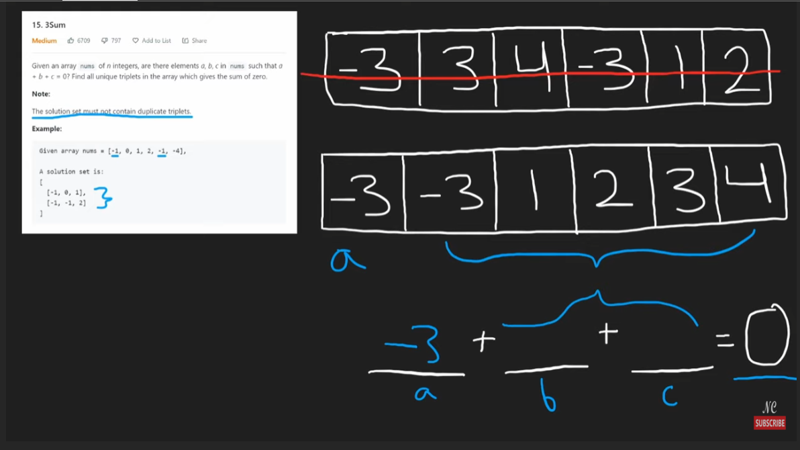
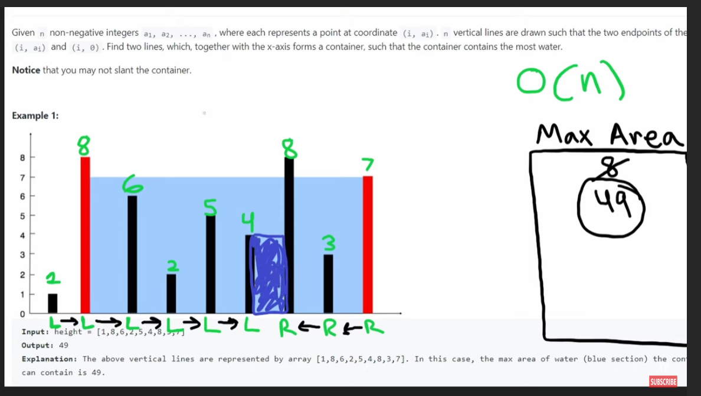

## Valid Palindrome

```python
class Solution:
    def isPalindrome(self, s: str) -> bool:
        #2 pointers, begine
        begin = 0
        end = len(s) - 1
        def isValid(char):
            print(char)
            if char and (48 <= ord(char) <= 57) or (65 <= ord(char) <= 90) or (97 <= ord(char) <= 122):
                return True
            return False

        while begin <= end:
            #skip the white space
            if isValid(s[begin]) and isValid(s[end]):
                # print(s[begin], s[end])
                if s[begin].lower() == s[end].lower():
                    begin += 1
                    end -= 1
                else:
                    return False
            elif not isValid(s[begin]):
                begin += 1
            elif not isValid(s[end]):
                end -= 1
            
        return True
```

## Two Sum Il - Input Array Is Sorted

When the input array is sorted, usually there are 2 patterns, use binary search for searching in O(log n) time and O(n) iterations, and 2 pointers in O(n) time.

```python
class Solution:
    def twoSum(self, numbers: List[int], target: int) -> List[int]:
        l, r = 0, len(numbers) - 1

        while l < r:
            curSum = numbers[l] + numbers[r]

            if curSum > target:
                r -= 1
            elif curSum < target:
                l += 1
            else:
                return [l + 1, r + 1]
        return []
```

## 3Sum



```python
class Solution:
    def threeSum(self, nums: List[int]) -> List[List[int]]:
        # 1 way is to use the hashmap, then similar to 2sums
        # but we can use sort to optimize it to O(1) space
        res = []
        nums.sort()

        for i, num in enumerate(nums):
            if i > 0 and nums[i] == nums[i - 1]:
                continue # Skip duplicates

            l, r = i + 1, len(nums) - 1
            while l < r:
                total = num + nums[l] + nums[r]
                if total == 0:
                    res.append([num, nums[l], nums[r]])
                    l += 1
                    r -= 1
                    while l < r and nums[l] == nums[l - 1]: # still continue to search
                        l += 1
                elif total < 0:
                    l += 1
                elif total > 0:
                    r -= 1

        return res
```

## Container With Most Water



```python
class Solution:
    def maxArea(self, heights: List[int]) -> int:
        # left and right
        l, r = 0, len(heights) - 1
        max_area = 0

        while l < r: # Move towards the lower boundary
            l_max, r_max = heights[l], heights[r]

            area = min(l_max, r_max) * (r - l)
            max_area = max(max_area, area)

            if l_max < r_max:
                l += 1
            else:
                r -= 1
                
        return max_area
```

## Trapping Rain Water

The difference between the last question is that we need to keep track of all the water, so instead of comparing the max areas, we need to have another 2 pointers represents the l_max, r_max where indicates that when the l, r moves, the amount of water it can total get.

```python
class Solution:
    def trap(self, height: List[int]) -> int:
        # increment the counts

        l, r = 0, len(height) - 1
        l_max, r_max = height[l], height[r]
        water_area = 0

        while l < r:
            # Move towards the higher boundary
            if l_max < r_max:
                l += 1
                #check if the new l_max, I more prefer this way although we can use the max() to simplify the code, but this version can illustrate the thinking process better.
                if height[l] < l_max:
                    water_area += l_max - height[l]
                else:
                    l_max = height[l]
            else:
                r -= 1
                if height[r] < r_max:
                    water_area += r_max - height[r]
                else:
                    r_max = height[r]
        
        return water_area
```

## Summary

Todo