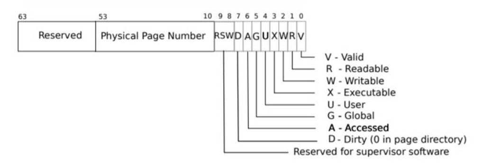

# OS Lab

## GDB

To debug the QEMU, type `make qemu-gdb` to start debugging

Open a new windows, type `gdb-multiarch` to connect the xv6, add a breakpoint where to debug and continue.

Some common commands.

`s`/`stepi` step into the code line by line

`n` go into the next statement


`tui enable` this will open a GUI that where the breakpoint currently locates inside the code

`layout asm` this will open a GUI that layout the breakpoint in assembly

`layout reg` this will open a GUI and layout all the registers values

`layout src` go back the original src file


## Lab1: Xv6 and Unix utilities

## Lab2: system calls

## Lab3: page tables

The lab manual can be found here.https://pdos.csail.mit.edu/6.828/2021/labs/pgtbl.html

### Speed up system calls ([easy](https://pdos.csail.mit.edu/6.828/2021/labs/guidance.html))

Purpose: speed up certain system calls by sharing data in a read-only region between user space and the kernel. This task is to map one read-only page at USYSCALL( a virtual address defined in memlayout.h). At the start of this page, store a `struct usyscall` (also defined in `memlayout.h`), and initialize it to store the PID of the current process.

```c
//proc.h
struct proc {
  struct spinlock lock;

  // p->lock must be held when using these:
  enum procstate state;        // Process state
  void *chan;                  // If non-zero, sleeping on chan
  int killed;                  // If non-zero, have been killed
  int xstate;                  // Exit status to be returned to parent's wait
  int pid;                     // Process ID

  // wait_lock must be held when using this:
  struct proc *parent;         // Parent process

  // these are private to the process, so p->lock need not be held.
  uint64 kstack;               // Virtual address of kernel stack
  uint64 sz;                   // Size of process memory (bytes)
  pagetable_t pagetable;       // User page table
  struct trapframe *trapframe; // data page for trampoline.S
  struct context context;      // swtch() here to run process

  struct file *ofile[NOFILE];  // Open files
  struct inode *cwd;           // Current directory
  char name[16];               // Process name (debugging)
  // add the struct to store the shared page table
  struct usyscall *usyscall;   //get pid
};

//proc.c
static struct proc*
allocproc(void)
{
  struct proc *p;

  for(p = proc; p < &proc[NPROC]; p++) {
    acquire(&p->lock);
    if(p->state == UNUSED) {
      goto found;
    } else {
      release(&p->lock);
    }
  }
  return 0;

found:
  p->pid = allocpid();
  p->state = USED;


  // Allocate a trapframe page.
  if((p->trapframe = (struct trapframe *)kalloc()) == 0){
    freeproc(p);
    release(&p->lock);
    return 0;
  }
  //Allocate a USYSCALL page, my implementation
  if((p->usyscall = (struct usyscall *)kalloc()) == 0){
    freeproc(p);
    release(&p->lock);
    return 0;
  }
  //share the pid between userspace and the kernel
  p->usyscall->pid = p->pid;
  // An empty user page table.
  p->pagetable = proc_pagetable(p);
  if(p->pagetable == 0){
    freeproc(p);
    release(&p->lock);
    return 0;
  }

  // Set up new context to start executing at forkret,
  // which returns to user space.
  memset(&p->context, 0, sizeof(p->context));
  p->context.ra = (uint64)forkret;
  p->context.sp = p->kstack + PGSIZE;

  return p;
}


// Create a user page table for a given process,
// with no user memory, but with trampoline pages.
pagetable_t
proc_pagetable(struct proc *p)
{
  pagetable_t pagetable;

  // An empty page table.
  pagetable = uvmcreate();
  if(pagetable == 0)
    return 0;

  // map the trampoline code (for system call return)
  // at the highest user virtual address.
  // only the supervisor uses it, on the way
  // to/from user space, so not PTE_U.
  if(mappages(pagetable, TRAMPOLINE, PGSIZE,
              (uint64)trampoline, PTE_R | PTE_X) < 0){
    uvmfree(pagetable, 0);
    return 0;
  }

  // map the trapframe just below TRAMPOLINE, for trampoline.S.
  if(mappages(pagetable, TRAPFRAME, PGSIZE,
              (uint64)(p->trapframe), PTE_R | PTE_W) < 0){
    uvmunmap(pagetable, TRAMPOLINE, 1, 0);
    uvmfree(pagetable, 0);
    return 0;
  }

  //create a page for usyscall and map with READ only and also allow it to be accessed by the USER.
  if(mappages(pagetable, USYSCALL, PGSIZE,
              (uint64)(p->usyscall), PTE_R | PTE_U) < 0){
    uvmunmap(pagetable, TRAMPOLINE, 1, 0);
    uvmunmap(pagetable, TRAPFRAME, 1, 0);
    uvmfree(pagetable, 0);
    return 0;
  }

  return pagetable;
}

// Don't forget to free the leaf of the USYSCALL page, else it will cause a leaf panic error
// Free a process's page table, and free the
// physical memory it refers to.
void
proc_freepagetable(pagetable_t pagetable, uint64 sz)
{
  uvmunmap(pagetable, TRAMPOLINE, 1, 0);
  uvmunmap(pagetable, TRAPFRAME, 1, 0);
  uvmunmap(pagetable, USYSCALL, 1, 0);
  uvmfree(pagetable, sz);
}
```

### Print a page table ([easy](https://pdos.csail.mit.edu/6.828/2021/labs/guidance.html))

Purpose: Print the contents of a page table

Define a function called `vmprint()`. It should take a `pagetable_t` argument, and print that pagetable in the format described below. Insert `if(p->pid==1) vmprint(p->pagetable)` in exec.c just before the `return argc`, to print the first process's page table. You receive full credit for this part of the lab if you pass the `pte printout` test of `make grade`.

```c


//vm.c
//use recursion to print the pte on page tables
void vmprint(pagetable_t pagetable,int r)
{
  // r =0. first r
  char *format ="";
  if(r == 0){
    pte_t pa = (uint64)pagetable;
    printf("page table %p\n",pa);
    format = "..";
    r++;
  }else if(r ==1){
    format = ".. ..";
    r++;
  }else if(r==2){
    format = ".. .. ..";
    r++;
  }

  for(int i=0;i<512;i++){
    pte_t pte = pagetable[i];
    //if there is a valid page
    if((pte & PTE_V) && (pte & (PTE_R|PTE_W|PTE_X)) == 0){
      // this PTE points to a lower-level page table.

      //PTE2PA will get the next page PA address
      uint64 child = PTE2PA(pte);
      printf("%s%d: pte %p pa %p\n",format,i,pte,child);
      // printf("child %p\n",child);
      vmprint((pagetable_t)child,r);
    } else if(pte & PTE_V){	//these are the leaf of the page
      uint64 child = PTE2PA(pte);
      printf("%s%d: pte %p pa %p\n",format,i,pte,child);

    }
  }

}


//exec.c
//add this code in int exec(char *path, char **argv) before the return argument to allow it to print the page table when the pid is 1
  if(p->pid ==1) vmprint(p->pagetable,0);

```

### Detecting which pages have been accessed ([hard](https://pdos.csail.mit.edu/6.828/2021/labs/guidance.html))

Purpose: Based on the input arguments, determine which pages have been accessed(read or write).

Your job is to implement `pgaccess()`, a system call that reports which pages have been accessed. The system call takes three arguments. First, it takes the starting virtual address of the first user page to check. Second, it takes the number of pages to check. Finally, it takes a user address to a buffer to store the results into a bitmask (a datastructure that uses one bit per page and where the first page corresponds to the least significant bit). You will receive full credit for this part of the lab if the `pgaccess` test case passes when running `pgtbltest`.



```c
//riscv.h
#define PTE_A (1L << 6) //Access Bit

//sysproc.c

#ifdef LAB_PGTBL
int
sys_pgaccess(void)
{
  //parse arugments
  uint64 va;
  int num;
  uint64 buffer; //buffer to store the result in bitmask ds
  int ans = 0;
  if(argaddr(0,&va) < 0) return -1;
  if(argint(1,&num)<0) return -1;
  if(argaddr(2,&buffer)<0) return -1;

  struct proc *p = myproc(); //get the current process status
  pagetable_t pagetable = p->pagetable; //the user page table

  for(int i=0;i<num;i++){
    pte_t *pte;
    pte = walk(pagetable,va+ (i * PGSIZE),0);

    if((pte != 0) && (*pte & PTE_A)){
      ans = ans | (1 << i);
      *pte = *pte ^ PTE_A;
    }
  }
  //copy the answer from kernel to the user space, stored in the third input argument ans,
    //copy byte by byte
  if(copyout(pagetable,buffer,(char *)&ans,sizeof(int)) < 0){
    return -1;
  }
  return 0;
//pgaccess(buf, 32, &abits)

}
#endif

```

### Bitmask data structure:

Bitmask Basics:

- **Representation**: A bitmask is typically represented as an integer where each bit corresponds to a specific option, flag, or element.
  - For example, an 8-bit bitmask can represent up to 8 different flags or states, with each bit in the byte being either `0` (off/false) or `1` (on/true).
- **Efficiency**: Bitmasks are efficient because they allow you to represent multiple states or flags within a single integer, using very little memory (e.g., 1 byte can store 8 flags).
- **Common Uses**:
  - **Flags**: In many programming languages, bitmasks are used to store flags, where each bit in the bitmask represents a different flag.
  - **Permissions**: Bitmasks are often used to store permission bits, where each bit represents a different permission (e.g., read, write, execute).
  - **Presence of Elements**: In algorithms, bitmasks can be used to represent whether certain elements or conditions are present.

### Explanation of Byte Pointer:

- **Pointer Basics**:

  - A pointer is a variable that holds the memory address of another variable.
  - The type of the pointer determines how the memory is accessed. For example, an `int*` pointer is expected to point to an `int` and thus access 4 bytes of memory (on most systems), whereas a `char*` pointer (byte pointer) accesses 1 byte of memory.

- **Byte Pointer (`char\*`)**:
  - A `char*` or `unsigned char*` pointer is often referred to as a byte pointer because `char` typically represents a single byte (8 bits) of data.
  - With a byte pointer, you can perform fine-grained memory operations, such as accessing and modifying memory byte by byte.

#### Example of Byte Pointer Usage:

Consider a scenario where you have an integer value, but you want to access or manipulate its bytes individually:

```c
#include <stdio.h>

int main() {
    int num = 0x12345678;   // A 4-byte integer
    char *byte_ptr = (char*)&num;  // Cast the address of num to a byte pointer

    // Access and print each byte of the integer
    for(int i = 0; i < sizeof(int); i++) {
        printf("Byte %d: 0x%x\n", i, byte_ptr[i]);
    }

    return 0;
}
```

#### Explanation:

- Memory Representation
  - `num` is a 4-byte integer. Its value `0x12345678` will be stored in memory as four bytes: `0x12`, `0x34`, `0x56`, `0x78`.
- Pointer Cast
  - `char* byte_ptr = (char*)#` converts the address of `num` (which is an `int*`) to a `char*`, allowing you to access the individual bytes of the integer.
- Byte-by-Byte Access
  - `byte_ptr[i]` accesses the `i`-th byte of `num`. Since `byte_ptr` is a `char*`, `byte_ptr[i]` accesses the memory one byte at a time.

#### Output:

```c
Byte 0: 0x78
Byte 1: 0x56
Byte 2: 0x34
Byte 3: 0x12
```

#### Why Use a Byte Pointer?

- **Memory Manipulation**: Byte pointers are useful when you need to manipulate data at a low level, such as copying raw memory, accessing specific bytes in a larger data structure, or working with binary data formats.
- **Typecasting**: Often, you might cast a higher-level pointer (e.g., `int*`, `float*`) to a `char*` to inspect or manipulate its bytes, as seen in the example above.

### Summary

I enhance some interesting things that i never notice before, `copyout(pagetable,buffer,(char *)&ans,sizeof(int))` this function is actually copying the data byte by byte, and it is a really useful technique if we want to write a generic function that accept different data types arguments and perform the copy. Idea is in C, the data type will define how many bytes of memory to read, let's say if the data type is int _, then it will read 4 bytes contiguous memory blocks. And since char _ only has the one byte(lowest), it will be safe to copy those memory blocks byte by byte and later cast those address to the original data type.

## Lab4: traps

### Backtrace ([moderate](https://pdos.csail.mit.edu/6.828/2021/labs/guidance.html))

Purpose: To understand a bit of RISC-V asm and understand the calling conventions, it is important to understand how RISC-V manage the stack for this part. 


Code part is super straightforward once understand the structure how RISC-V manage the stack, from the question, Note that the <u>return address lives at a fixed offset (-8) from the frame pointer of a stackframe, and that the saved frame pointer lives at fixed offset (-16) from the frame pointer</u>. And also <u>Xv6 allocates one page for each stack in the xv6 kernel at PAGE-aligned address. You can compute the top and bottom address of the stack page by using `PGROUNDDOWN(fp)` and `PGROUNDUP(fp)` (see `kernel/riscv.h`. These number are helpful for `backtrace` to terminate its loop.</u>

```c
//kernel/printf.c
void backtrace(void)
{
  printf("test");
  uint64 fp = r_fp();
  uint64 bot = PGROUNDDOWN(fp);
  uint64 top = PGROUNDUP(fp);

  printf("backtrace:\n");  
  while((fp > bot) && (fp < top)){
          // so to find the address of the ra, we know it is -8 of the frame pointer, so is the fp-8, then cuz it is an address value, need to cast this to a pointer and want to find the exact memory at this address so dereference into that
    uint64 *ra = (uint64 *) (fp -8);
    printf("%p\n",*ra);
    fp = *(uint64 *) (fp -16);
  }

}
//kernel/riscv.h
//this code is provided to get the s0(fp), frame pointer of the stack
static inline uint64
r_fp()
{
  uint64 x;
  asm volatile("mv %0, s0" : "=r" (x) );
  return x;
}
```

The only tricky part is to cast the address to a pointer and dereference that pointer address to get the return address in each stack frame. ` uint64 *ra = (uint64 *) (fp -8);`


### Alarm ([hard](https://pdos.csail.mit.edu/6.828/2021/labs/guidance.html))

Purpose: Add a feature to xv6  that periodically alerts a process as it uses CPU time. This will involve interrupt practice which needs return the saved registers from jump from user space to kernel.


Add a function sigalarm(interval, handler) system call.


```c
//user.h
int sigalarm(int ticks, void (*handler)());
int sigreturn(void);

//proc.h
int ticks;
int interval;
void (*handler)();  //define a handler function pointer
struct trapframe *alarmtrapframe;

//sysproc.c -> main implementation for sigalarm and return
uint64
sys_sigalarm(void)
{
  //Your sys_sigalarm() should store the alarm interval and the pointer to the handler function in new fields in the proc structure (in kernel/proc.h).
  struct proc *p = myproc();
  int interval;
  uint64 handler;
  if(argint(0, &interval) < 0) //get the first tick argument
    return -1;

  if(argaddr(1, &handler) < 0)  //get the second address argument
    return -1;

  p->interval = interval;  
  p->handler = (void (*)())handler;
  p->ticks = 0;
  p->alarmtrapframe = 0;
  //execute the handler function until the ticks cycle 
  return 0;
}

uint64
sys_sigreturn(void)
{
  struct proc *p = myproc();
  if(p->alarmtrapframe !=0){
    memmove(p->trapframe,p->alarmtrapframe,sizeof(struct trapframe));
    kfree(p->alarmtrapframe);
    p->alarmtrapframe = 0;	//alarmtrapframe will be used like a semaphore to make sure only one process can make this system call until it returns (Prevent re-entrant calls to the handler----if a handler hasn't returned yet, the kernel shouldn't call it again)
  }
  //restore the alarmtrapframe to trapframe
  return 0;
}

//usertrap.c
  // give up the CPU if this is a timer interrupt.
  if(which_dev == 2){
    if(p->interval != 0){
      p->ticks ++;
      if(p->ticks == p->interval){
        p->ticks = 0;
        if(p->alarmtrapframe == 0){	
          p->alarmtrapframe = kalloc();
          //copy the trapframe registers to alarmtrapframe
          //notes: cannot directly use size of a struct pointer since it is only a memory address
          //sizeof(struct trapframe) = 288
          memmove(p->alarmtrapframe,p->trapframe,sizeof(struct trapframe));
          p->trapframe->epc =(uint64)p->handler;
        }

      }else{
        yield();
      }
    }else{
      yield();
    }
  }
```

Reference:

https://www.cnblogs.com/weijunji/p/14338466.html


### More

x86 and RISC-V difference, based on my experience in both x86 and RISC-v, found there are quite some difference in these two architectures. Some difference are,

#### 1. **Instruction Set Complexity**:

- **x86**: It is a **Complex Instruction Set Computing (CISC)** architecture, meaning it has a large number of complex instructions, some of which can perform multiple operations in a single instruction. x86 instructions can vary in length, and some instructions are highly specialized.
- **RISC-V**: It is a **Reduced Instruction Set Computing (RISC)** architecture. The instructions are simpler, fixed in size, and designed to execute within one clock cycle. RISC-V has a smaller and more uniform set of instructions, which makes the assembly language easier to learn and the hardware simpler to implement.

#### 2. **Registers**:

- **x86**: It has a smaller number of general-purpose registers (like `EAX`, `EBX`, `ECX`, `EDX` for 32-bit, and `RAX`, `RBX`, etc., for 64-bit), and some registers have specific uses (e.g., `RSP` for the stack pointer).
- **RISC-V**: It has 32 general-purpose registers (`x0` to `x31`), with `x0` always hardwired to zero. The register usage is more flexible compared to x86.

#### 3. **Addressing Modes**:

- **x86**: Supports a variety of complex addressing modes, such as register indirect with displacement, base-plus-index, and more.
- **RISC-V**: Has simpler addressing modes, primarily focused on register-indirect and immediate offsets.

#### 4. **Instruction Format**:

- **x86**: Instructions can be of varying lengths (from 1 to 15 bytes), and the format is quite complex due to the need for backward compatibility.
- **RISC-V**: Instructions are uniformly 32 bits in length (in the base ISA), making decoding simpler and faster.

#### 5. **Function Calling Conventions**:

- **x86**: The calling conventions are complex, with arguments passed through registers and the stack, and specific registers reserved for return values (`EAX`, `RAX`) and other purposes.
- **RISC-V**: Has a simpler calling convention. Function arguments are passed in registers `a0` to `a7`, and return values are typically passed in `a0` (and `a1` for double-word results).

#### 6. **Branching**:

- **x86**: Has a variety of conditional and unconditional branch instructions, with complex branch prediction mechanisms.
- **RISC-V**: Uses a simpler set of branch instructions, with conditions typically being checked via comparison instructions that set flags.

#### 7. **Stack Management**:

- **x86**: Uses a dedicated stack pointer (`ESP`/`RSP`), with push and pop instructions.
- **RISC-V**: Also uses a stack, but it is managed more manually, with load and store instructions. There are no dedicated push/pop instructions; instead, you manually adjust the stack pointer and store/load values.


## 2020 Lab: Lazy allocation

The purpose of this lab is to understand the lazy allocation of user-space heap memory, 

Consider, for example, that a gigabyte consists of 262,144 4096-byte pages; that's a huge number of allocations even if each is individually cheap. In addition, some programs allocate more memory than they actually use (e.g., to implement sparse arrays), or allocate memory well in advance of use. 

To allow sbrk() to complete more quickly in these cases, sophisticated kernels allocate user memory lazily. That is, sbrk() doesn't allocate physical memory, but **just remembers which user addresses are allocated and marks those addresses as invalid** in the user page table. When the process first tries to use any given page of lazily-allocated memory, the CPU generates a page fault, which the kernel handles by allocating physical memory, zeroing it, and mapping it. You'll add this lazy allocation feature to xv6 in this lab.

### Eliminate allocation from sbrk() ([easy](https://pdos.csail.mit.edu/6.828/2020/labs/guidance.html))

```c
uint64
sys_sbrk(void)
{
  int addr;
  int n;

  if(argint(0, &n) < 0)
    return -1;
  addr = myproc()->sz;
  myproc()->sz = myproc()->sz + n;
  // if(growproc(n) < 0)
  //   return -1;
  return addr;
}
```

Instead of directly allocating the size on sbrk, increase the size only but without allocating the memory first.

### Lazy allocation ([moderate](https://pdos.csail.mit.edu/6.828/2020/labs/guidance.html))

Add the page fault handler to realize the lazy allocation, only allocate the required memory when there is a page fault which will cause the trap.

```c
void
usertrap(void)
{
  ...
  } else if((which_dev = devintr()) != 0){
    // ok
  } else if (r_scause() == 13 || r_scause() == 15) {
    // 13: page load fault; 15: page write fault
    // printf("page fault\n");
    uint64 addr = r_stval();
    if (lazy_alloc(addr) < 0) {
      p->killed = 1;
    }
  } else {
    printf("usertrap(): unexpected scause %p pid=%d\n", r_scause(), p->pid);
    printf("            sepc=%p stval=%p\n", r_sepc(), r_stval());
    p->killed = 1;
  }
  ...
}

int
lazy_alloc(uint64 addr) {
  struct proc *p = myproc();
  // page-faults on a virtual memory address higher than any allocated with sbrk()
  // this should be >= not > !!!
  if (addr >= p->sz) {
    // printf("lazy_alloc: access invalid address");
    return -1;
  }

  if (addr < p->trapframe->sp) {
    // printf("lazy_alloc: access address below stack");
    return -2;
  }
  
  uint64 pa = PGROUNDDOWN(addr);
  char* mem = kalloc();
  if (mem == 0) {
    // printf("lazy_alloc: kalloc failed");
    return -3;
  }
  
  memset(mem, 0, PGSIZE);
  if(mappages(p->pagetable, pa, PGSIZE, (uint64)mem, PTE_W|PTE_X|PTE_R|PTE_U) != 0){
    kfree(mem);
    return -4;
  }
  return 0;
}
```

### Lazytests and Usertests ([moderate](https://pdos.csail.mit.edu/6.828/2020/labs/guidance.html))

To enhance the lazy allocation from part2.

- Handle negative sbrk() arguments.
- Kill a process if it page-faults on a virtual memory address higher than any allocated with sbrk().
- Handle the parent-to-child memory copy in fork() correctly.
- Handle the case in which a process passes a valid address from sbrk() to a system call such as read or write, but the memory for that address has not yet been allocated.
- Handle out-of-memory correctly: if kalloc() fails in the page fault handler, kill the current process.
- Handle faults on the invalid page below the user stack.

```c
uint64
walkaddr(pagetable_t pagetable, uint64 va)
{
  pte_t *pte;
  uint64 pa;

  if(va >= MAXVA)
    return 0;

  pte = walk(pagetable, va, 0);
  if(pte == 0 || (*pte & PTE_V) == 0) {
    if (lazy_alloc(va) == 0) {
      pte = walk(pagetable, va, 0);
    } else {
      return 0;
    }
  }
  if((*pte & PTE_U) == 0)
    return 0;
  pa = PTE2PA(*pte);
  return pa;
}
```

## Lab5: Copy-on-Write Fork for xv6

The problem:

The fork() system call in xv6 copies all of the parent process's user-space memory into the child. If the parent is large, copying can take a long time. Worse, the work is often largely wasted; for example, a fork() followed by exec() in the child will cause the child to discard the copied memory, probably without ever using most of it. On the other hand, if both parent and child use a page, and one or both writes it, a copy is truly needed.

### Implement copy-on write([hard](https://pdos.csail.mit.edu/6.828/2021/labs/guidance.html))****

