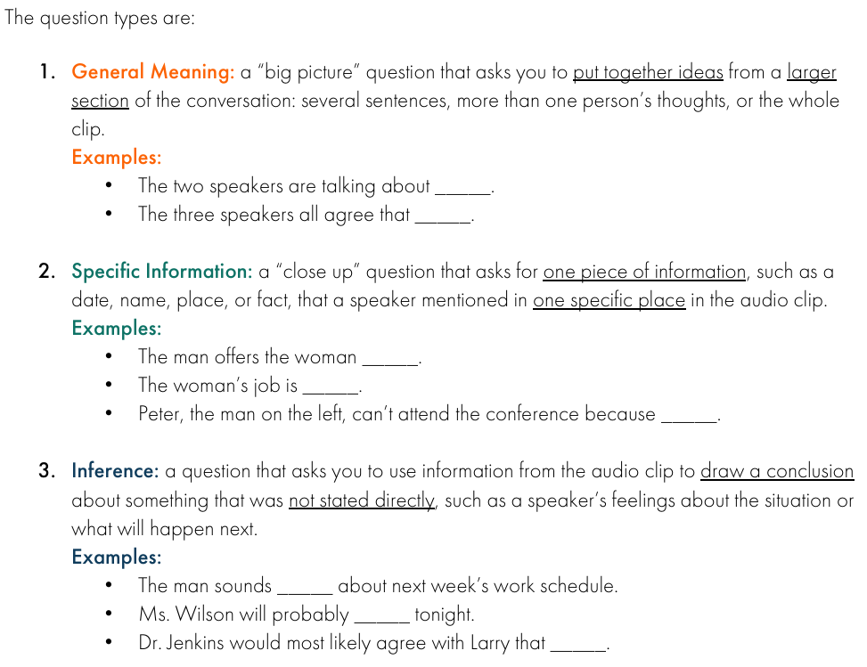
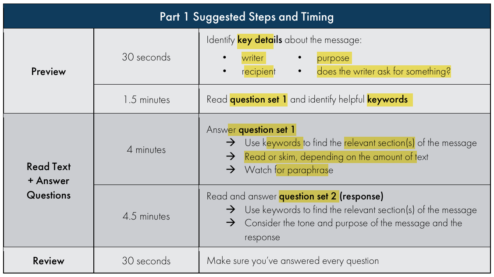
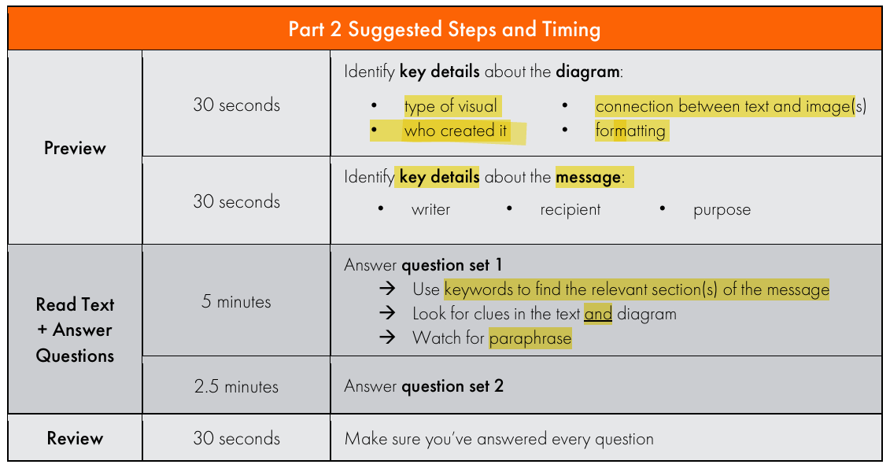
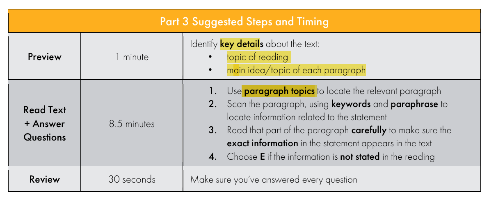
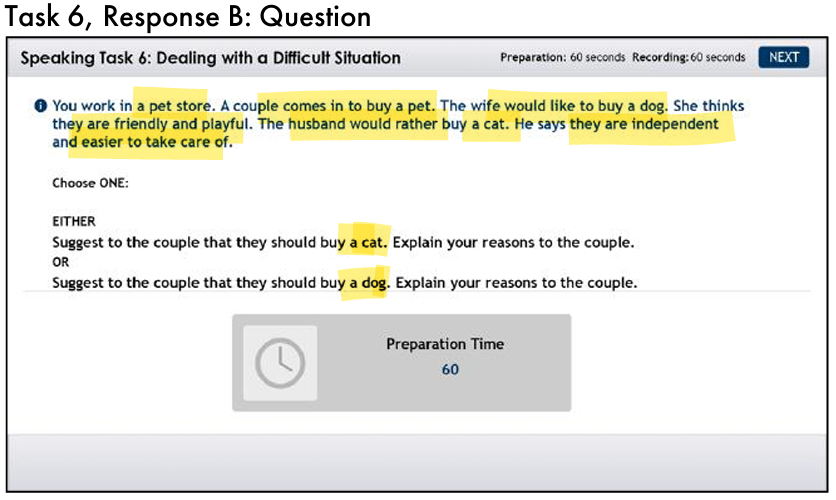

# CELPIP

Notes are allowed in all sections.

## Listening

### Question Types:

### Part1 - 3

## Reading

### Question Types

### Part1 - Email

### Part2 - Diagram with email

### Part 3 - informational

1. Read questions first.
2. Read each single paragraph and put that paragraph to the correspond matching answer.

### Part 4 - Opinions

1. Read the questions and identify helpful keywords
2. Read through the paragraph and try to see if an answer would appear

## Writing

### Task1

### Task2

> I strongly believe that extending library hours would benefit the public more than adding additional digital resources.
>
> Currently, the library operates from 10 a.m. to 4 p.m., which is inconvenient for individuals who work full-time during weekdays. By extending the operating hours, more people would have the opportunity to use the library in the evenings for self-study and personal development.
>
> Furthermore, I have observed that many people visit the library after lunchtime, often making it difficult to find seating. As the space becomes more crowded, the noise level also increases. Extended hours would help distribute visitor traffic more evenly throughout the day, easing congestion and creating a quieter, more productive atmosphere.
>
> In conclusion, I strongly support the extension of library hours, as it would offer greater flexibility and allow more members of the community to benefit from a peaceful space to study, work, and relax.

## Speaking

### Task 1: Giving Advice

1. Congrats
2. Student Loan
3. Scholarship
4. Part time jobs
5. Apply for summer internship

1. Initiate a conversation about work
2. Ask her out for a coffee
3. Find common interests

### Task 2: Talking about a Personal Experience

1. Part time job - tutor younger
2. Programming for grade 5 and 6 students
3. Computer engineering degree and I like playing around with children

### Task 3: Describing a Scene

### Task 4: Making Predictions 

### Task 5: Comparing and Persuading

### Task 6: Dealing with a Difficult Situation

Natural flows

### Task 7: Expressing Opinions

### Task 8: Describing an Unusual Situation 

