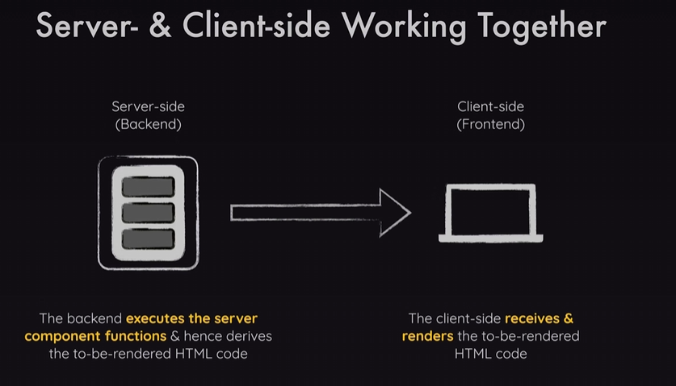
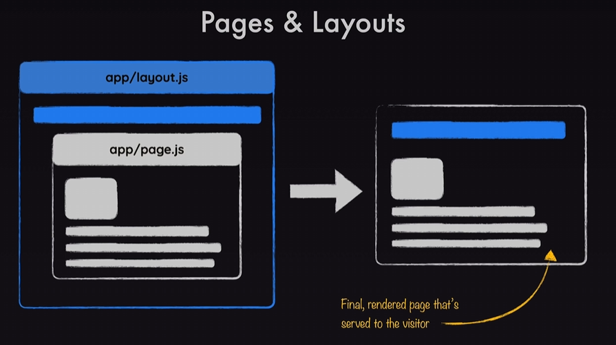

# Web Notes:

## Next.JS

### Link

`<a href>`, will always refresh the page

so for page rerouting, we can use Link

### Layout 

layout is just a wrapper around all pages, it can be nested to the subfolder

### Global.css

import in the layout

### Component folder

Add components under App folder structure, no right or wrong inside or outside app folder.

I prefer outside

### Reserved Filenames

As you already learned, there are some reserved filenames when working with NextJS.

Important: These filenames are only reserved when creating them inside of the `app/` folder (or any subfolder). Outside of the `app/` folder, these filenames are not treated in any special way.

Here's a list of reserved filenames in NextJS - you'll, of course, learn about the important ones throughout this section:

- `page.js` => Create a new page (e.g., `app/about/page.js` creates a `<your-domain>/about` page)
- `layout.js` => Create a new layout that wraps sibling and nested pages
- `not-found.js` => Fallback page for "Not Found" errors (thrown by sibling or nested pages or layouts)
- `error.js` => Fallback page for other errors (thrown by sibling pages or nested pages or layouts)
- `loading.js` => Fallback page which is shown whilst sibling or nested pages (or layouts) are fetching data
- `route.js` => Allows you to create an API route (i.e., a page which does NOT return JSX code but instead data, e.g., in the JSON format)

You also find a list with all supported filenames & detailed explanations in the official docs: https://nextjs.org/docs/app/api-reference/file-conventions