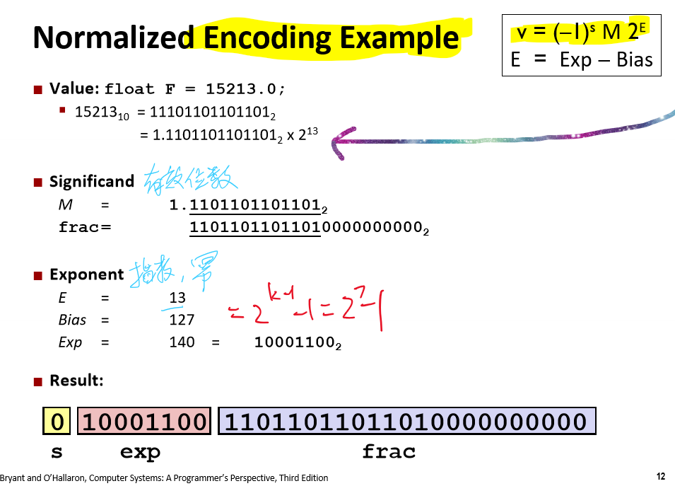
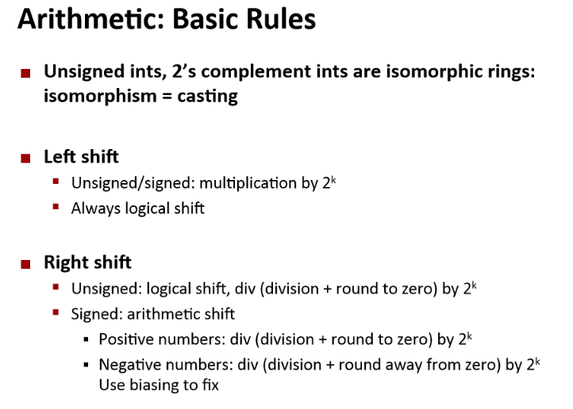

# CSAPP - Computer System

## Lab1

### Floating point:




Will always convert to the form of M = 1.xxx, and M x 2^pow

#### floatFloat2Int(f)

> 将浮点数转换为整数

- 代码

```c
/* 
 * floatFloat2Int - Return bit-level equivalent of expression (int) f
 *   for floating point argument f.
 *   Argument is passed as unsigned int, but
 *   it is to be interpreted as the bit-level representation of a
 *   single-precision floating point value.
 *   Anything out of range (including NaN and infinity) should return
 *   0x80000000u.
 *   Legal ops: Any integer/unsigned operations incl. ||, &&. also if, while
 *   Max ops: 30
 *   Rating: 4
 */
int floatFloat2Int(unsigned uf) {
  int s_    = uf>>31;
  int exp_  = ((uf&0x7f800000)>>23)-127;
  int frac_ = (uf&0x007fffff)|0x00800000;
  if(!(uf&0x7fffffff)) return 0;

  if(exp_ > 31) return 0x80000000;
  if(exp_ < 0) return 0;

  if(exp_ > 23) frac_ <<= (exp_-23);
  else frac_ >>= (23-exp_);

  if(!((frac_>>31)^s_)) return frac_;
  else if(frac_>>31) return 0x80000000;
  else return ~frac_+1;
}
```

- 思路

首先考虑特殊情况：如果原浮点值为0则返回0；如果真实指数大于31（frac部分是大于等于1的，1<<31位会覆盖符号位），返回规定的溢出值**0x80000000u**；如果 𝑒𝑥𝑝<0 （1右移x位,x>0，结果为0）则返回0。剩下的情况：首先把小数部分（23位）转化为整数（和23比较），然后判断是否溢出：如果和原符号相同则直接返回，否则如果结果为负（原来为正）则溢出返回越界指定值**0x80000000u**，否则原来为负，结果为正，则需要返回其补码（相反数）。

The idea is to apply the concept that when converting from the binary int to the float format, need to use the normalized encoding idea.


### Takeaway:





* Any arithmetic operations with unsigned values will cast the result to be unsigned.

*  The size_t defined as unsinged value with length = word size, In C++, `size_t` is a data type used to represent the size of objects. It's an unsigned integer type that's capable of storing the size in bytes of any object. Its actual size can vary depending on the platform and compiler, but it's typically chosen to **be large enough** to represent the maximum possible size of a theoretically possible object on the given platform. size_t is better than used unsigned_int .Reference https://pvs-studio.com/en/blog/terms/0044/#:~:text=The%20size_t%20is%20chosen%20so,64%2Dbit%20one%2064%20bits.
* The **2's complement** of a value is **~x + 1;**

